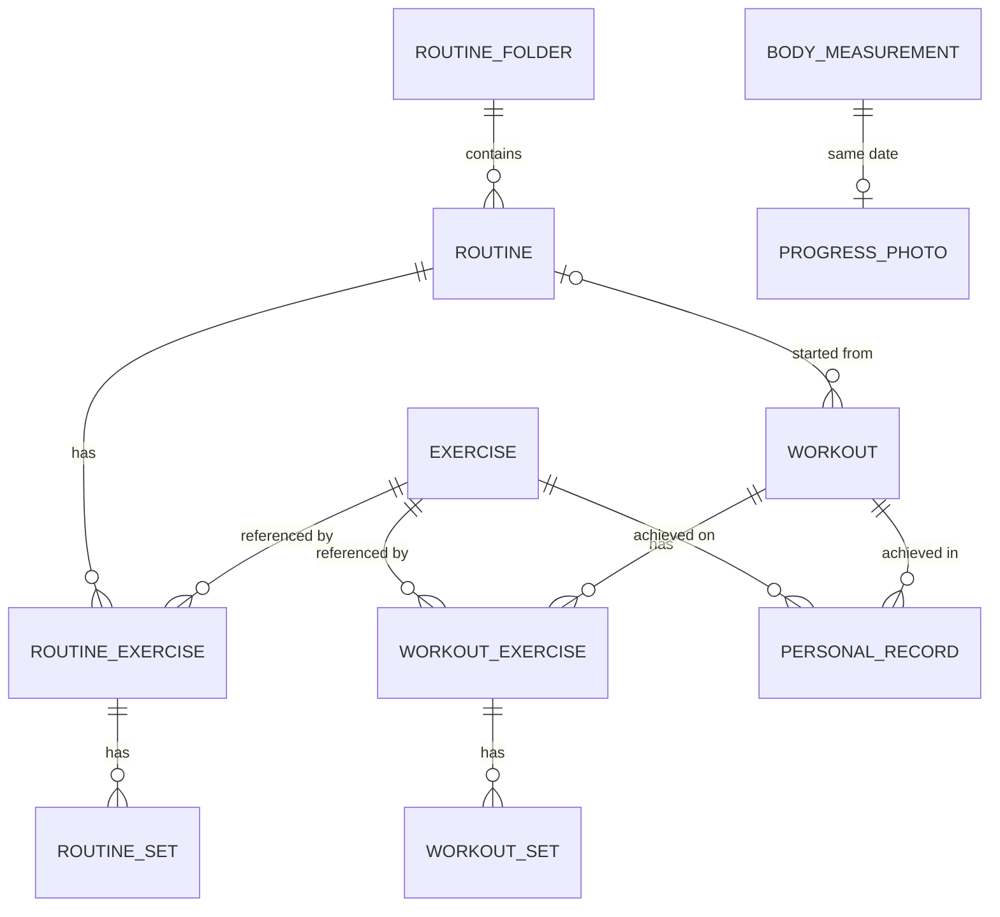

# logEZ — Phase 2 Implementation Plan

**Date:** 2026-08-23 · **Status:** awaiting Owner approval before Phase 3 (implementation)
**Basis:** [PHASE1_RESEARCH.md](PHASE1_RESEARCH.md) (scope approved 2026-08-22: everything unlocked, no caps, no importers, no social/cloud/AI; widgets/Wear OS/Health Connect deferred)

---

## 1. Overview

logEZ is a private, local-only Android workout tracker cloning Hevy's personal training-log functionality. One user, one device, no network. The plan below is written so each implementation milestone can be executed in a fresh session without re-deciding anything: entities, screens, calculations, and build order are all specified here, anchored to the verified Hevy research in `docs/research/`.

> **Reading note:** sections below occasionally cite "the SPINE" / "spine" — that is the locked decision set now embodied in §§1–4 of this document (scope, tech decisions, data model, navigation).

**Locked scope decisions (Owner, 2026-08-22):**
- All former Pro behavior is the default; **no caps anywhere** (routine count, custom exercises, chart history, measurements — and no 150-set cap either), and no gating/paywall/license code paths exist.
- No social/community surface, no accounts/cloud, no AI, no telemetry, no ads.
- **No importers** — fresh data start. CSV export (Hevy-compatible schema) and JSON backup/restore are in scope.
- Deferred to Phase 4: home-screen widgets, Wear OS, Health Connect.
- No Hevy copyrighted assets: original UI, original instruction text, placeholder media.

## 2. Architecture

### 2.1 Stack

| Layer | Choice | Notes |
|---|---|---|
| Language | Kotlin 2.x | |
| UI | Jetpack Compose, Material 3, single Activity | No XML/Views/Fragments |
| Navigation | Navigation-Compose | Typed routes, 3 bottom tabs |
| Persistence | Room (normalized schema) + DataStore Preferences | **No JSON-blob columns** — Fiterval's blob-mirror lesson |
| Serialization | kotlinx.serialization | Seed assets + JSON backup |
| Async | Coroutines + Flow | ViewModel → immutable `UiState` |
| DI | **Hilt (recommended)** | Alternative: manual factory (Fiterval ADR-0003 precedent). Hilt recommended because logEZ has ~12 ViewModels, 8+ DAOs/repos, and a foreground service that needs injected repos — the manual factory's wiring cost grows quadratically with that surface. Owner may veto at this checkpoint. |
| Live workout | Foreground service + ongoing notification | Complete-set / −15s / +15s / skip actions |
| Build | AGP + Kotlin pinned as a pair once chosen in M0, documented in the repo README (Fiterval toolchain lesson) | minSdk 26, current targetSdk |

### 2.2 Module & package structure

Single Gradle module (`app`), **package-by-feature** (vault Clean Code distillation: feature slices over horizontal layers). A personal app gains nothing from multi-module builds.

```
com.enil.logez
├── core
│   ├── common          // Result wrappers, clock abstraction, dispatchers
│   ├── data            // Room db, entities, DAOs, converters, DataStore, repositories (impl)
│   ├── domain          // repository interfaces, calculation engines (OneRepMax, Volume, PrEngine, Streak), models
│   └── designsystem    // theme, tokens, typography, reusable atoms (SetRow, StatCard, EmptyState…)
├── feature
│   ├── history         // History tab, workout detail
│   ├── routines        // Workout tab, folders, routine builder
│   ├── workout         // live logger, rest timer, finish flow, foreground service, mini-bar
│   ├── exercises       // library, exercise detail, custom exercise editor
│   ├── analytics       // profile tab, charts, records, calendar
│   ├── measurements    // measurements, progress photos
│   └── settings        // settings tree, export/backup
└── app                 // Activity, NavHost, bottom bar, Hilt application
```

Conventions (enforced from M0):
- One ViewModel per screen exposing a single immutable `UiState` data class; events via sealed `UiEvent`. No business logic in composables.
- Repositories are interfaces in `core/domain`, implemented in `core/data`; ViewModels never see Room types.
- Platform side-effects (sound, vibration, wakelock, notifications) live in dedicated controllers injected where needed — never in ViewModels (Fiterval rule, keeps them JVM-testable).
- All list composables use stable keys; fast-tick flows (rest countdown, elapsed time) are collected in the deepest composable that renders them (Fiterval recomposition lesson).
- Stable UUID string IDs on every entity; never positional identity.

## 3. Data model / ERD

Canonical stored units: **kg / meters / seconds**; timestamps = epoch millis UTC; measurement dates = ISO `LocalDate` strings. Every entity carries `createdAt`/`updatedAt`.



### 3.1 Enums

| Enum | Values |
|---|---|
| `SetType` | `NORMAL`, `WARMUP`, `FAILURE`, `DROPSET` |
| `ExerciseType` | `WEIGHT_REPS`, `REPS_ONLY` (UI: "Bodyweight reps"), `BODYWEIGHT_WEIGHTED` (weight = added load), `BODYWEIGHT_ASSISTED` (weight = assistance), `DURATION`, `WEIGHT_DURATION`, `DISTANCE_DURATION`, `WEIGHT_DISTANCE`; seed-only: `FLOORS_DURATION`, `STEPS_DURATION` (log via `customMetric`) |
| `MuscleGroup` (20) | `ABDOMINALS SHOULDERS BICEPS TRICEPS FOREARMS QUADRICEPS HAMSTRINGS CALVES GLUTES ABDUCTORS ADDUCTORS LATS UPPER_BACK TRAPS LOWER_BACK CHEST CARDIO NECK FULL_BODY OTHER` |
| `Equipment` (9) | `NONE BARBELL DUMBBELL KETTLEBELL MACHINE PLATE RESISTANCE_BAND SUSPENSION OTHER` |
| `PrType` (9) | `HEAVIEST_WEIGHT BEST_1RM BEST_SET_VOLUME BEST_SESSION_VOLUME MOST_REPS_SET MOST_SESSION_REPS LONGEST_DISTANCE LONGEST_TIME BEST_TIME` |
| Others | `WeightUnit` KG/LB · `DistanceUnit` KM/MILES · `ThemeMode` LIGHT/DARK/SYSTEM · `PreviousValuesMode` ANY_WORKOUT/SAME_ROUTINE · `WorkoutStatus` IN_PROGRESS/COMPLETED |

RPE is a nullable `Double` restricted to `{6.0, 7.0, 7.5, 8.0, 8.5, 9.0, 9.5, 10.0}` (validated in domain, not by the DB).

### 3.2 Entities

**`exercises`** — the library (400 seeded + unlimited custom)

| Field | Type | Notes |
|---|---|---|
| id | TEXT PK | UUID; seed rows use fixed UUIDs (idempotent re-seed) |
| name | TEXT | "Bench Press (Barbell)" naming style, original list |
| exerciseType | TEXT enum | immutable after creation (Hevy parity) |
| primaryMuscleGroup | TEXT enum | indexed — drives muscle analytics |
| secondaryMuscleGroups | TEXT | JSON list via TypeConverter |
| equipment | TEXT enum | indexed — library filter |
| instructions | TEXT | original 2–4-step text |
| mediaPath | TEXT? | placeholder illustration; user-set for custom |
| isCustom | INTEGER bool | |
| isBodyweightVolumeEligible | INTEGER bool | true only for seed rows of the four 100%-bodyweight movement families — Pull Up, Chin Up, Dips, Handstand Push Up — **including their weighted/assisted seed variants** (e.g. Pull Up (Weighted), Chin Up (Assisted)); always false on custom rows. Partial-bodyweight weighted moves (weighted push-ups/sit-ups) stay false. Verified rule: research/followup-1.md |
| isDeleted | INTEGER bool | soft delete keeps history renderable |
| createdAt / updatedAt | INTEGER | |

**`routine_folders`** — id PK, name, orderIndex, createdAt, updatedAt. ("Programs" are folders of routines.)

**`routines`** — id PK, folderId? (FK→routine_folders, `SET NULL` — deleting a folder keeps its routines in "My Routines"), name, notes?, orderIndex, createdAt, updatedAt.

**`routine_exercises`** — id PK, routineId (FK `CASCADE`), exerciseId (FK `RESTRICT` — can't hard-delete a referenced exercise; soft delete instead), orderIndex, supersetGroup `INT?` (null = not in a superset; members share a group number, color derived from it), restTimerSeconds `INT?` (null = app default at add-time, 0 = off), notes? (persistent routine note, link-aware).

**`routine_sets`** — id PK, routineExerciseId (FK `CASCADE`), orderIndex, setType, targetWeightKg?, targetReps?, targetRepRangeMin?, targetRepRangeMax? (rep range and exact reps are mutually exclusive; ranges never auto-update from performance), targetDurationSeconds?, targetDistanceMeters?. No target RPE (verified: consumer Hevy has none; revisit only on Owner request).

**`workouts`** — id PK, routineId? (FK `SET NULL`), title, notes?, status (`IN_PROGRESS`/`COMPLETED` — at most one IN_PROGRESS row, enforced in repo logic; this row is the process-death recovery point), startedAt, endedAt?, durationSeconds (explicit and editable — supports pause and backdated logging), createdAt, updatedAt. Indexed on (status), (startedAt).

**`workout_exercises`** — id PK, workoutId (FK `CASCADE`), exerciseId (FK `RESTRICT`), orderIndex, supersetGroup?, restTimerSeconds?, notes? (session note; rendered greyed-out next time the exercise is logged, replaced if rewritten — Hevy parity).

**`workout_sets`** — id PK, workoutExerciseId (FK `CASCADE`), orderIndex, setType, weightKg?, reps?, durationSeconds?, distanceMeters?, rpe?, customMetric? (floors/steps), isCompleted, completedAt?. Which value columns are populated is dictated by the exercise's `ExerciseType` (spine mapping). Indexed on workoutExerciseId.

**`personal_records`** — id PK, exerciseId (FK `CASCADE`), workoutId (FK `CASCADE`), workoutSetId?, prType, value (kg / seconds / meters / reps / kg·reps by type), achievedAt. **This is a derived cache**, not source of truth: the PR engine rebuilds affected exercises' rows on every workout save/edit/delete (spec in §8). Unique index (exerciseId, prType).

**`body_measurements`** — date TEXT PK (ISO LocalDate; one entry per day — Hevy parity, 409-on-duplicate becomes upsert-with-confirm), weightKg?, leanMassKg?, fatPercent?, and 14 circumference fields (neckCm, shoulderCm, chestCm, leftBicepCm, rightBicepCm, leftForearmCm, rightForearmCm, abdomenCm, waistCm, hipsCm, leftThighCm, rightThighCm, leftCalfCm, rightCalfCm), updatedAt. All 17 metrics enabled (former Pro gate — unlocked).

**`progress_photos`** — id PK, date (LocalDate), filePath (app-private storage), createdAt. One per day (repo-enforced, replace-with-confirm).

### 3.3 Not in Room

- **Settings** → DataStore Preferences: units (+ per-exercise unit override map), theme, first-day-of-week, default rest timer, timer sound id + 3 volume levels (timer / set-complete / PR), previous-values mode, warm-up-sets-count-in-stats, keep-awake, plate-calculator toggle + equipment JSON (bars/plates incl. custom), RPE tracking, smart superset scrolling, inline timer, live-PR notification + volume, warm-up formula (editable steps, default 40%×5 / 60%×5 / 80%×3, plate/dumbbell rounding), bodyweight-for-volume cache (last known weight).
- **Media files** → app-private storage (`filesDir/photos`, `filesDir/exercise-media`), never external storage.

### 3.4 DAOs (one per aggregate)

`ExerciseDao`, `RoutineDao` (folders + routines + nested upsert transactions), `WorkoutDao` (incl. `getInProgress()`, history paging, exercise-history query), `RecordsDao`, `MeasurementDao`, `PhotoDao`, plus `AnalyticsDao` for aggregate SQL (volume/sets per period, per-muscle set counts, calendar day list). Nested writes (routine with exercises+sets; workout save) are `@Transaction` upserts that diff child rows by id.

## 4. Navigation graph

Three bottom tabs (the de-socialized Hevy layout — its Home feed with zero followed users is your own history, which is exactly our History tab):

```
Root NavHost
├── history/            History tab (landing) → workoutDetail/{id}
├── workout/            Workout tab → routineBuilder/{id|new}?folderId=
│                                   → folder management (inline)
├── profile/            Profile tab → analytics dashboards → exerciseLibrary → exerciseDetail/{id}
│                                   → measurements → progressPhotos → settings/{...} → exportBackup
└── logger/             Live Workout Logger (full-screen, above tabs)
      ├── restTimer overlay · plateCalc sheet · warmupCalc sheet · rpePicker sheet
      └── finish/        Save Workout screen → summary/{workoutId}
```

- Sub-screens hide the bottom bar; only the three tab roots show it.
- Leaving `logger/` while a workout is IN_PROGRESS shows a persistent in-app mini-bar (elapsed time + return tap) above the bottom bar; the ongoing notification covers the app-backgrounded case.
- `exerciseDetail` is reachable from library, logger (tap exercise name), and workout detail — same destination, `from` arg only affects back behavior.

## 5. Screen-by-screen breakdown

Two parts: 5.1 covers workout creation and live logging (the app's core loop); 5.2 covers history, library, analytics, measurements, and settings. Both conform to §§2–4.

## 5.1 Screen-by-screen breakdown — Part 1: Workout creation & live logging

This part covers the Workout tab and every surface reachable from it up to the post-save summary. Shared conventions for all surfaces in 5.1: every list is a `LazyColumn` with stable keys (entity UUID `id`s, never indices); every bottom sheet is a Material 3 `ModalBottomSheet`; every three-dots menu is a `DropdownMenu` anchored to an `IconButton`; destructive actions confirm via `AlertDialog`; drag-to-reorder uses the `sh.calvin.reorderable` Compose library (hand-rolled drag state is the fallback if it fights us). Fast-tick values (workout elapsed time, rest countdown, inline-timer seconds) are exposed as separate `Flow`s from the ViewModel/service and collected **only inside the leaf composable that renders the digits** — never folded into the screen-level `UiState` (spine rule; Fiterval recomposition lesson).

### 5.1.1 Workout tab (folders + routines)

**Purpose.** Home for templates: start an empty workout, browse/organize `routine_folders` and `routines`, and launch any routine into a live session. This is Hevy's Workout tab with the entire Explore surface removed — no program library, no share actions anywhere (research/logging-workflows.md §3).

**Layout regions** (top → bottom):
1. `TopAppBar` — title "Workout", actions: **new-folder** icon and **new-routine** icon (Hevy puts the folder icon "above Explore"; with Explore gone these move into the app bar — research/logging-workflows.md §3).
2. Pinned **"+ Start Empty Workout"** `FilledTonalButton` (full-width, always first item).
3. Routines list: a section per folder (header row = folder name + collapse chevron + folder three-dots), then routines with `folderId = null` under an implicit "My Routines" header at the end. Folders and routines each ordered by `orderIndex`.

**Routine card**: routine name, one-line exercise preview ("Bench Press, Incline DB Press, +3 more"), a blue **"Start Routine"** button, and a three-dots menu.

**Interactions.**
- Tap "Start Empty Workout" / "Start Routine" → creates a `workouts` row (`status = IN_PROGRESS`, `routineId` set or null), starts the foreground service, navigates to the Live Logger. If an `IN_PROGRESS` workout already exists (one active workout at a time — spine), show an `AlertDialog`: **Resume workout in progress** / **Discard it and start new** (discard = hard delete after a second confirm).
- Tap routine card body → read-only routine detail (exercise/set list, Edit + Start buttons).
- Routine three-dots: **Start Routine · Edit · Duplicate · Move to folder · Reorder · Delete**. Duplicate opens the Routine Builder pre-filled with title "<name> (copy)" and no history attached (research/logging-workflows.md §2). No Share (hard rule).
- Folder three-dots: **Rename · + Add new routine (opens builder with `folderId` prefilled) · Reorder · Delete folder**. Deleting a folder moves its routines to root (`folderId` FK `SET NULL` — spine) after a confirm that says exactly that. No Share.
- **Reorder** (from either menu) enters a reorder mode: drag handles appear, long-press-drag persists new `orderIndex` values on drop. Tap-hold-dragging a routine onto a folder header moves it into that folder (research/logging-workflows.md §3).
- Folder header tap toggles collapse (collapsed set kept in `rememberSaveable`, not persisted).

**State.** `WorkoutTabViewModel` → `UiState(folders: List<FolderWithRoutines>, rootRoutines, activeWorkoutId?)` from Room `Flow`s. No fast-tick state here except the mini-bar (5.1.3), which overlays tabs globally.

**Edge cases.** Empty state (no routines): illustration + "Create your first routine" CTA. Unlimited folders/routines — no cap checks anywhere. Renaming to blank is rejected inline. Reordering while a rename dialog is open is impossible (modal).

### 5.1.2 Routine Builder

**Purpose.** Create/edit a routine template: pick exercises, set per-set targets, set types, rest timers, notes, supersets. Full-screen destination, bottom bar hidden.

**Layout regions.**
1. `TopAppBar`: back (discard-confirm if dirty), routine-title `TextField` placeholder "Routine title", **Save** `TextButton` (disabled until title non-blank and ≥1 exercise).
2. Body `LazyColumn`: one **exercise card** per `routine_exercises` row (keyed by id), then a blue **"+ Add Exercise"** button (research/logging-workflows.md §2).

**Exercise card anatomy** (top → bottom):
- Header: exercise name (tap → exercise detail), superset color bar + label when `supersetGroup != null`, three-dots menu.
- **Routine note** field (`routine_exercises.notes`): single collapsed line expanding on focus; URLs rendered as tappable links via `LinkAnnotation` when not editing (routine notes support links — research/logging-workflows.md §2).
- **Rest Timer row**: "Rest Timer: Default (1:30)" / an explicit value ("2:00") / "Off" — the parenthetical always reflects the current Default Rest Timer setting → opens the rest-timer picker sheet (below).
- **Set table**: header row + one row per `routine_sets` (keyed by id) + grey **"+ Add Set"**.

**Set table columns by `ExerciseType`** (targets only; the same column matrix returns in 5.1.3 with logging columns added):

| ExerciseType | Target columns |
|---|---|
| WEIGHT_REPS | KG/LBS · REPS |
| REPS_ONLY | REPS |
| BODYWEIGHT_WEIGHTED | +KG (added load) · REPS |
| BODYWEIGHT_ASSISTED | −KG (assistance) · REPS |
| DURATION | TIME |
| WEIGHT_DURATION | KG/LBS · TIME |
| DISTANCE_DURATION | DISTANCE · TIME |
| WEIGHT_DISTANCE | KG/LBS · DISTANCE |

(The literal "+KG"/"−KG" header glyphs are our own design — Hevy's exact headers are unverified, but the semantics (added weight vs assistance amount, one weight field) are confirmed — research/followup-1.md.)

**Interactions.**
- **REPS header tap** toggles that exercise's rep mode between exact reps and rep range (research/logging-workflows.md §2). Exact mode: one REPS cell → `targetReps`. Range mode: two cells "6 – 8" → `targetRepRangeMin`/`targetRepRangeMax`. Toggling to range seeds `min` from `targetReps`; toggling back keeps `min` as `targetReps`. Invariant enforced on save: `targetReps` XOR range pair, never both. Validation: `min ≤ max`, both ≥ 1.
- **Set-number tap** → `DropdownMenu`: "Normal Set", "W — Warmup Set", "F — Failure Set", "D — Dropset", "Remove Set" (research/logging-workflows.md §7). Selection writes `routine_sets.setType`; the SET cell renders the number, or a colored W/F/D badge.
- **Swipe-left on a set row** reveals red Delete (`SwipeToDismissBox`) — same removal as the menu item.
- **"+ Add Set"** appends a row copying the previous row's targets and `setType = NORMAL`.
- **Rest-timer picker** (`ModalBottomSheet`): wheel/`LazyColumn` picker — "Default (uses app setting)", "Off", then 0:05 → 5:00 in 5-second steps (Hevy documents only the ~5 s–5 min range; the step size is our choice — research/logging-workflows.md §9). Maps to `restTimerSeconds`: null = app default, 0 = off (spine). Newly added exercises start at null.
- **Exercise three-dots**: **Reorder** (enters drag mode across all cards), **Replace Exercise** (opens exercise picker; keeps the set list, preserving targets whose fields exist on the new `ExerciseType`, clearing the rest), **+ Add to Superset**, **Remove From Superset** (when grouped), **Add Warm Up Sets** (5.1.6), **Remove Exercise** (research/logging-workflows.md §2).
- **Superset creation**: "+ Add to Superset" enters a selection scrim — tap any other exercise card to join/create a group (research/logging-workflows.md §8). `supersetGroup` is the next unused Int for the routine; adding to an existing member's group extends it (giant sets/circuits — unlimited members and groups). Color = `supersetPalette[supersetGroup % 8]` from an 8-color design-system palette; rendered as a left edge bar + "Superset" chip on each member.
- **No RPE anywhere in this screen** — RPE is live-logging only; `routine_sets` has no RPE column (research/followup-2.md).

**State.** `RoutineBuilderViewModel` holds an in-memory draft (`RoutineDraft` mirroring `routines` + `routine_exercises` + `routine_sets`); Save writes one Room transaction. Editing an existing routine loads the draft from DB. If launched with 2+ folders existing and no `folderId` given, a destination-folder dialog shows first (research/logging-workflows.md §2). Back with unsaved changes → discard-confirm dialog.

**Edge cases.** Zero-exercise save blocked. Numeric cells accept locale decimal input, stored canonical kg/meters/seconds with display conversion (spine). Replacing an exercise with itself is a no-op. Deleting the last set of an exercise leaves an empty table (allowed; the logger will just show "+ Add Set"). No set-count cap (Owner removed even the 150-set cap).

### 5.1.3 Live Workout Logger (centerpiece)

**Purpose.** The live session: log sets fast (tap-to-fill + one-tap check), run timers, edit structure mid-workout. Full-screen destination above the tabs (spine navigation); runs under the foreground service with the ongoing notification (spine). `Keep Awake` setting applies `FLAG_KEEP_SCREEN_ON` here only.

**Layout regions.**
1. `TopAppBar`: **elapsed duration** (top-left, tap → "Pause Workout Timer"/"Resume Workout Timer" menu — research/logging-workflows.md §5), live counters for completed sets and volume, compact **rest-countdown chip** when a timer runs, **Finish** button top-right.
2. Body `LazyColumn` of exercise cards (keyed by `workout_exercises.id`).
3. Footer items: blue **"+ Add Exercise"**, grey **"Settings"** button opening the in-workout settings sheet (Smart Superset Scrolling, Inline Timer, RPE Tracking, Plate Calculator, Keep Awake, sounds — research/logging-workflows.md §5).
4. **Keyboard accessory bar** (when a numeric cell is focused): a Compose `Row` pinned above the IME via `imePadding()` — field-navigation arrows/Next, **RPE** button (when RPE tracking is on and the exercise is rep-based), **Calculator** button (when the focused cell is a weight cell on an `Equipment.BARBELL` exercise and the plate-calculator setting is on) (research/ux-conventions.md §1). We use the system numeric IME + accessory bar, not a custom keypad (Hevy's keypad internals are unverified; only the accessory buttons are documented — research/ux-conventions.md gaps).

**Exercise card** = the 5.1.2 card plus logging affordances: session **note** field (`workout_exercises.notes`; last session's note shows greyed and non-editable underneath — overwriting replaces it, otherwise it disappears after this session — research/logging-workflows.md §11), the **rest-timer countdown bar** slot below the note area (5.1.4), and the logging set table.

**Set-row table**: `SET · PREVIOUS · <type-specific inputs> · [RPE] · ✓`. Type-specific inputs follow the exact 5.1.2 matrix; seed-only `FLOORS_DURATION`/`STEPS_DURATION` exercises show a FLOORS/STEPS cell (→ `workout_sets.customMetric`) + TIME (spine). The RPE column appears only when the setting is on and only for rep-based types (research/followup-2.md). Completed rows get a tinted background; target/auto-filled values render as grey placeholders until edited or checked.

**Interactions.**
- **PREVIOUS tap-to-fill**: the PREVIOUS cell shows the matching set (by `orderIndex`, same exercise) from the source chosen by `PreviousValuesMode` (`ANY_WORKOUT` vs `SAME_ROUTINE`), formatted "50 kg × 10" (+ " @ 8.5" if RPE present); tapping fills those values into the row's inputs without completing it (research/ux-conventions.md §1; research/logging-workflows.md §6). Rows beyond the previous session's set count show "—".
- **Auto-fill**: adding a previously-done exercise pre-populates set count, weights, and reps from last time, editable (research/ux-conventions.md §1). Routine-started workouts pre-fill from `routine_sets` targets (rep ranges display as "6–8" placeholders in REPS).
- **Check (✓) tap** — the core gesture; in order: (1) commit values — an untouched row commits its grey placeholders as-is (widely reported, unverified in official text; we adopt it — research/ux-conventions.md gaps); (2) validate — a FAILURE set with 0 reps is rejected with an inline error ("log the last completed rep") (research/logging-workflows.md §7); (3) set `isCompleted = true`, `completedAt = now`; (4) play the set-complete sound; (5) start the rest timer **unless the next set of this exercise is a DROPSET** (research/logging-workflows.md §7) — timer length resolves `restTimerSeconds`: explicit value → use it, 0 → none, null → Default Rest Timer setting; (6) run the live PR check → PR banner if the Live PR setting is on (research/logging-workflows.md §13); (7) **Smart Superset Scrolling**: if the exercise has `supersetGroup` and the setting is on, `animateScrollToItem` to the next member by `orderIndex`, wrapping to the first (research/logging-workflows.md §8). Un-checking reopens the row and cancels nothing retroactively.
- **Set add/remove**: grey "+ Add Set" appends (copying the previous row's values as placeholders); **swipe-left → red Delete** removes (research/logging-workflows.md §2, §5); set-number menu also offers Remove Set plus the four `SetType` options.
- **Mid-workout exercise ops** (three-dots): Reorder (drag mode), Replace Exercise, + Add to Superset / Remove From Superset, Add Warm Up Sets, **Update Bodyweight** (dialog writing today's `body_measurements.weightKg` — feeds bodyweight-volume math for eligible seed exercises; research/followup-1.md), Remove Exercise (research/logging-workflows.md §5; research/ux-conventions.md §6).
- **Duration stopwatch**: elapsed = pause-aware accumulation owned by the foreground service; pausing freezes `durationSeconds` accrual (spine: `durationSeconds` editable, pause-aware).
- **Inline Timer** (setting): DURATION-family sets show a play/pause stopwatch button in the TIME cell that counts up into `durationSeconds` (research/logging-workflows.md §5); one inline timer runs at a time.
- **Navigating away mid-workout** (back gesture or tab tap): the logger collapses to an **in-app mini-bar** docked above the bottom tab bar on all tab screens — workout title, live elapsed time, rest countdown when active, tap anywhere to re-expand, small "Finish" affordance. This is our own surface (Hevy's in-app minimized bar is unverified — research/ux-conventions.md gaps); it mirrors the ongoing notification, which carries current exercise, next-set target, elapsed time, rest countdown, and complete-set / −15 / +15 / skip actions (research/ux-conventions.md §3; spine).

**State.** `WorkoutLoggerViewModel` write-through: every edit persists immediately to `workout_sets`/`workout_exercises` (status stays `IN_PROGRESS`) so process death recovers mid-set (spine). `UiState` holds the structural snapshot; elapsed-time, rest-countdown, and inline-timer `Flow`s come from the foreground service and are collected deep — in the top-bar digits composable, the countdown bar/chip, the TIME cell, and the mini-bar respectively (spine rule).

**Edge cases.** App relaunch with an `IN_PROGRESS` workout → mini-bar appears immediately + a "Resume workout?" snackbar. Discard workout (three-dots on the logger's top bar → Discard Workout) → confirm → hard delete + service stop. Finish with zero completed sets → offer Discard instead. Finish with unfinished sets → dialog "You have N incomplete sets — they will be discarded" (Finish / Cancel). Weighted/assisted semantics: `weightKg` stores only the added load (WEIGHTED) or assistance amount (ASSISTED); bodyweight itself is never stored in sets (research/followup-1.md). Notification permission denied → session still works; only the notification surface is lost (service keeps running).

### 5.1.4 Rest timer surface

**Purpose.** Enforce rest between sets with zero taps to start.

**Placement & components.** On auto-start, a **countdown bar renders inside the triggering exercise's card, below the note area** (verified placement — research/logging-workflows.md §9): remaining time (m:ss), a thin `LinearProgressIndicator`, and three controls — **−15**, **+15**, **Skip** (−15/+15 verified; an in-app Skip is only documented on the notification surface, so the in-app Skip button is our addition — research/logging-workflows.md gaps). A compact chip with the same countdown sits in the logger top bar (and the mini-bar) so it stays visible while scrolled away. The same countdown + −15/+15/skip actions appear on the foreground-service notification (spine).

**Behavior.** Auto-starts on set completion per 5.1.3 rules; a new completion replaces any running timer. At zero: timer sound (5 selectable sounds) at the configured Timer Volume (high/normal/low/off) + vibration (research/logging-workflows.md §9). −15 below 0:15 ends the timer. Skip cancels silently.

**State.** The countdown lives in the foreground service (single source of truth; survives navigation and process-death restart via persisted end-timestamp); the UI collects `restRemaining: Flow<Duration>` deep in the bar/chip composables only.

**Edge cases.** Timer expiring while backgrounded → notification alert only. Completing a different exercise's set mid-countdown → replace timer with that exercise's duration. `restTimerSeconds = 0` (off) → no bar, no sound.

### 5.1.5 Plate Calculator sheet

**Purpose.** Show which plates to load per side for the focused weight (research/logging-workflows.md §15).

**Entry.** Calculator button on the keyboard accessory bar — only for `Equipment.BARBELL` exercises with the Plate Calculator setting on (research/ux-conventions.md §4). EZ/short bars are modeled as custom bars, not separate equipment.

**Layout** (`ModalBottomSheet`): target weight (synced live with the focused cell) · bar selector (`FilterChip` row of enabled bars) · a bar-loading **diagram** (Canvas: plate rectangles scaled/colored by weight, per side) · text list "Per side: 20 · 10 · 2.5" · **Available Equipment** section header with a **Manage** button.

**Manage** (second sheet): toggle list of enabled bars/plates, **"+ Custom Bar"** and **"+ Custom Plate"** dialogs (weight + optional color), swipe-to-delete on custom items (research/logging-workflows.md §15). Persisted in DataStore, not Room (spine).

**Algorithm & fallback.** Per-side = (target − bar) / 2; greedy heaviest-first over enabled plates (unlimited pairs). If unreachable exactly: banner **"Closest possible weight is X kg"** with the diagram rendered for X and a "Use X kg" button that writes X into the cell (research/logging-workflows.md §15). Display in the exercise's effective unit; math in kg.

**Edge cases.** Target < bar weight → "Bar alone weighs Y". No plates enabled → prompt to Manage. Assisted/weighted bodyweight exercises never show the button (equipment ≠ BARBELL).

### 5.1.6 Warm-up Calculator

**Purpose.** Insert percentage-based `WARMUP` sets above the working sets. Available in both the Routine Builder and the Live Logger via exercise three-dots → **Add Warm Up Sets**; always enabled (no Pro gate — hard rule) behind the Warm-up Calculator setting toggle (research/ux-conventions.md §5).

**Layout** (`ModalBottomSheet`): working-weight input (prefilled from the exercise's first `NORMAL` set weight) · formula table — default **40%×5, 60%×5, 80%×3** — each row with editable percent + reps and a remove control, plus **Add Set** and **Reset to Default** (research/ux-conventions.md §5; research/logging-workflows.md §7) · computed preview column showing the rounded weight per row · rounding preferences (barbell: round to nearest weight achievable with the enabled plate-calculator equipment; dumbbell: round to a configurable increment, default 2.5 kg — research/ux-conventions.md §5) · blue **"Insert Warmup Sets"** button.

**Behavior.** Insert prepends the rows as `setType = WARMUP` sets at `orderIndex` 0..n of the exercise (research/logging-workflows.md §7), re-indexing existing sets. The edited formula persists globally in DataStore as the "Warmup Method" (also editable from Settings). Warm-up sets are excluded from stats/PRs unless the separate Warm-up Sets setting includes them (spine).

**Edge cases.** No working weight available → input starts blank, Insert disabled until filled. Non-barbell, non-dumbbell equipment → no rounding (raw percentage). Re-invoking does not delete previously inserted warm-ups (it just prepends again — matching the "insert" verb; user removes extras by swipe).

### 5.1.7 RPE picker

**Purpose.** Attach a nullable RPE to a logged set. **Live logging only — never rendered in the Routine Builder**; `routine_sets` carries no RPE field (research/followup-2.md).

**Entry.** Tap the RPE cell, or the RPE accessory-bar button for the focused row (research/ux-conventions.md §1). Column exists only when the RPE Tracking setting is on and the exercise is rep-based (research/logging-workflows.md §10).

**Layout** (`ModalBottomSheet` "Log Set RPE"): a single-select row/wheel of the eight allowed values **6 · 7 · 7.5 · 8 · 8.5 · 9 · 9.5 · 10** (spine enum), a large label + RIR description that updates with selection ("RPE 8 — could have done 2 more reps"), a **Clear** action (sets `rpe = null` — blanks allowed, e.g. warm-ups), and **Done** (research/logging-workflows.md §10). RIR text mapping: 6→"4+ more reps", 7→"3 more", 7.5→"2–3 more", 8→"2 more", 8.5→"1–2 more", 9→"1 more", 9.5→"maybe 1 more", 10→"max effort — nothing left".

**Edge cases.** Values outside the enum are unenterable by construction (picker, no free text). RPE on an uncompleted row is kept and committed with the row.

### 5.1.8 Finish flow

Three chained surfaces after **Finish**:

**(a) Save Workout screen** (full-screen). Regions: title `TextField` (default = routine name, or a time-of-day name like "Morning Workout" for empty workouts — our convention; a title field is strongly implied but unverified in Hevy's articles, research/logging-workflows.md gaps) · description field → `workouts.notes` · **Date & time** and **Duration** rows opening scroll pickers — fully editable, enabling backdated manual logging (`startedAt`, `durationSeconds`, `endedAt` derived) (research/logging-workflows.md §12) · **Routine Settings** section (routine-based workouts only) with the **"Update Routine Values"** toggle — when on, logged weights/reps overwrite the routine's targets on save, **except rep-range targets, which never auto-update** (research/logging-workflows.md §6) · **Save** button. No photo, no Visibility row (social removed — hard rule). Compose: plain `Column` in a `Scaffold`; `DatePickerDialog`/`TimePickerDialog` + a wheel duration picker.

**(b) Update Routine prompt** (`AlertDialog`, conditional). Shown only if the session made **structural** changes vs. the source routine — exercises or sets added/removed/reordered, detected by diffing the logged structure against a routine snapshot taken at workout start. Options: **"Update Routine"** (rewrite `routine_exercises`/`routine_sets` to match the session) vs **"Keep Original Routine"**. Never shown for value-only changes — those follow the toggle in (a) (research/logging-workflows.md §12).

**Save transaction** (one Room transaction, then service stop): delete uncompleted `workout_sets` → set `status = COMPLETED`, `endedAt`, final `durationSeconds` → apply routine-value updates and/or structural routine rewrite per (a)/(b) → rebuild `personal_records` for affected exercises (derived-cache rule, spine).

**(c) Post-save summary** (full-screen, celebratory). Shows: total volume, completed sets, duration, ordinal workout count ("Workout #47"), current weekly streak, and **PR medals** — one card per PR achieved naming the exercise and `PrType` (research/logging-workflows.md §12–13). No share buttons/images (social removed). Done → History tab, where backdated workouts sort by their edited `startedAt` (research/logging-workflows.md §12).

**Edge cases.** Setting date/time into the future is clamped to now. Duration edits are free-form (backdating support) and don't retro-tick timers. Killing the app on the Save screen leaves the workout `IN_PROGRESS` (recoverable — nothing is finalized until the save transaction). Streak/PR computation uses the edited (backdated) `startedAt`.

### 5.1.9 Exercise picker sheet (shared selection surface)

**Purpose.** Every "+ Add Exercise" and "Replace Exercise" entry point in the Routine Builder (5.1.2) and Live Logger (5.1.3) opens this picker — the Exercise Library (§5.2) rendered in selection mode inside a full-height `ModalBottomSheet`.

**Components.** The library's own search field, Equipment/Muscle filter chips, and sort order (recently-logged first, then custom, then alphabetical) are reused verbatim — one implementation, two modes. A "+ Create" row at the top opens custom-exercise creation (§5.2) and returns with the new exercise pre-selected. Soft-deleted exercises never appear.

**Add mode (multi-select).** Tapping rows toggles a selection badge; a pinned bottom `Button` reading **"Add N exercises"** commits them in tap order — Routine Builder: new `routine_exercises` rows with one empty set each; Logger: new `workout_exercises` rows with previous-session auto-fill per 5.1.3. Selection count is unlimited (no cap code).

**Replace mode (single-select).** Tapping a row replaces immediately per the 5.1.2 rules (targets preserved where the new `ExerciseType` shares fields); in the Logger, a confirm dialog appears first when the replaced exercise already has completed sets ("Completed sets will be kept but re-attributed" is NOT offered — completed sets are discarded after confirm; simpler and unambiguous).

**Edge cases.** Empty search result shows "No exercises match" + "Create '<query>' as a custom exercise". Picking the same exercise twice in add mode is allowed (Hevy permits duplicate exercise entries in a workout).

### 5.1.10 Edit past workout (logger in edit mode)

**Entry.** Workout Detail → three-dots → **Edit Workout** (§5.2). Reuses the Live Logger screen with an "Editing — <date>" top bar and these differences:

- **No foreground service, no rest timers, no sounds, no live PR banners, no elapsed ticking.** In place of the stopwatch, editable **Date & time** and **Duration** rows (same pickers as 5.1.8a).
- All values and structure are editable exactly as in live logging (add/remove/reorder/replace exercises, set types, RPE, notes); checkmarks toggle `isCompleted`. PREVIOUS shows what it showed relative to the workout's own `startedAt` (resolution query uses `before = startedAt`).
- **Save** (top-right) = one transaction: update in place — `status` stays `COMPLETED`, `startedAt`/`durationSeconds`/`endedAt` per the edited fields, uncompleted rows dropped after a warning — then rebuild `personal_records` for the union of exercises present before and after the edit (§3.2 derived-cache rule). Returns to Workout Detail.
- **No routine-update prompts fire from edit mode** (*clone decision* — routine syncing is a live-session concern; Hevy's edit-flow behavior here is unverified).
- Back/Cancel discards after a confirm. Removing every exercise blocks Save ("Delete the workout instead").

## 5.2 Screen-by-screen breakdown — Part 2: History, library, analytics, measurements, settings

Conventions for every screen below: one ViewModel per screen exposing an immutable `UiState` (Loading / Content / Empty); all lists are `LazyColumn`s with stable keys; all sub-screens hide the bottom bar (SPINE navigation); all weights/distances are stored kg/meters/seconds and converted at display time only, honoring the global `WeightUnit`/`DistanceUnit` and the per-exercise unit override. Warm-up sets (`SetType.WARMUP`) are excluded from every stat, chart, and PR surface in this section unless the "Warm-up Sets count in stats" setting is on (research/logging-workflows.md §7). Empty states are honest: they explain what will appear and route the user to the action that produces data — they never render zeroed charts, sample data, or fabricated metrics.

### History tab (landing tab — the de-socialized Home)

**Purpose.** The app's landing destination: a reverse-chronological feed of *your own* completed workouts. This is exactly what Hevy's Home feed degenerates to with zero followed users (research/social-surface.md §3), minus the Discover toggle, suggested-users carousel, likes, and comments — none of which exist in logEZ.

**Layout regions.** (1) Top app bar: screen title "History", no actions (no search icon in v1; calendar lives on Profile). (2) Feed: paged `LazyColumn` of workout cards. (3) When a workout is IN_PROGRESS and the user browses here, the collapsed live-workout mini-bar sits above the bottom tab bar (SPINE navigation); IN_PROGRESS workouts never appear as feed cards — the feed queries `workouts WHERE status = COMPLETED ORDER BY startedAt DESC`.

**Workout card components** (per-card stats mirror Hevy's feed-post stats overview, de-socialized — research/social-surface.md §1):
- Title, relative date line ("Yesterday", "12 Aug"), start time.
- Stats row: Duration (`durationSeconds`), Volume (Σ weightKg×reps over completed non-warm-up sets, converted to display unit), Sets count. A "Records" chip with medal icon appears only when `personal_records` rows reference this `workoutId`; when there are none, the chip is absent — never "0 PRs".
- Exercise summary list: first 3 `workout_exercises` as "3 × Bench Press (Barbell)" lines (completed-set count × exercise name), then "See N more exercises" if longer.
- No like/comment/share row of any kind (research/social-surface.md §3).

**Interactions.** Tap card → Workout Detail. Long-press → same overflow menu as Workout Detail (Edit / Copy / Save as Routine / Delete). Feed is backed by Room + Paging 3 (recommended) so years of history stay cheap; card stats come from a single DAO aggregate query, not stored columns. Backdated workouts sort by their edited `startedAt`, matching Hevy's profile-history ordering (research/logging-workflows.md §12).

**States.** Loading (first Room emission) → skeleton cards; Content; Empty. **Empty state:** illustration + "No workouts yet. Your completed workouts will appear here." + primary button "Start a workout" navigating to the Workout tab. No fake stats, no sample card.

### Workout Detail

**Purpose.** Read-only record of one completed workout: header stats, full exercise/set breakdown, notes, PR medals — Hevy's workout screen with the like/comment/share rows deleted (research/social-surface.md §3).

**Layout regions.** (1) Top bar: back, workout title, three-dot overflow. (2) Header block: date + time, source routine name if `routineId` is set (tappable → routine), workout-level `notes` if present. (3) Stats strip: Duration · Volume · Sets · Records (records cell shown only if PRs exist). (4) Exercise list: one block per `workout_exercise` in `orderIndex` order. (5) No footer social row.

**Exercise block components.** Exercise name (tap → Exercise Detail), superset color bar when `supersetGroup` is non-null (matching the logger's per-group color), the session note (`workout_exercises.notes`) under the name, then the set table: set number with type letter (W/F/D per `SetType`, styled as in the logger), the logged values formatted per the exercise's `ExerciseType` (weight×reps, reps, time, distance+time, weight+distance, `customMetric` for the seed-only stair types), RPE when present, and a medal icon on any set with a matching `personal_records` row (`workoutSetId`), with the `PrType` name shown on tap (e.g. "Best 1RM").

**Overflow menu (interactions).**
- **Edit Workout** — opens the full editor (logger in edit mode, no timers; flow specified in Part 1); on save, `personal_records` is rebuilt for affected exercises (SPINE entity 9).
- **Copy Workout** — starts a new live workout pre-filled from this one (research/logging-workflows.md §14). If a workout is already IN_PROGRESS, show "Finish or discard your current workout first" (one active workout at a time, SPINE).
- **Save as Routine** — creates a routine from the exercise/set structure (research/logging-workflows.md §2), opening the routine editor pre-filled.
- **Delete Workout** — confirm dialog ("This can't be undone"); hard delete cascades `workout_exercises`/`workout_sets`, then PR rebuild for every exercise that appeared in it (SPINE).

**States.** Content only (screen is always reached with a valid id); deleted-while-open resolves by popping back. No empty state applies.

### Exercise Library

**Purpose.** Browse and manage the 400 seeded + unlimited custom exercises. Reached from Profile → Exercises (browse mode) and reused as the picker behind every "+ Add Exercise" button (picker behavior — multi-select and Add — is specified with the routine builder/logger in Part 1) (research/library-analytics.md §1).

**Layout regions.** (1) Top bar: back, "Exercises", "+ Create" action. (2) Search field. (3) Filter row: two dropdown chips — Equipment (9 `Equipment` values) and Muscle (20 `MuscleGroup` values, matches `primaryMuscleGroup` OR membership in `secondaryMuscleGroups`). (4) Sectioned list.

**Components & sort.** Row = thumbnail (custom exercises: their `mediaPath` image; seeds: `mediaPath` is null and resolves to the primary-muscle-group illustration at display time, §7.5 — never Hevy assets), name, primary muscle subtitle, "Custom" badge when `isCustom`. Sort order clones Hevy: recently-logged exercises first (by most recent `completedAt` of any set referencing the exercise), then custom exercises, then the rest alphabetically (research/library-analytics.md §1). Rows with `isDeleted = true` never appear here or in pickers, but remain resolvable from history (soft delete keeps history valid — SPINE entity 1).

**Custom exercise creation ("+ Create").** Full-screen form: Image (photo picker/camera → copied into app storage, path in `mediaPath`), Name (required), Equipment (one of 9), Primary muscle (one of 20), Secondary muscles (multi-select), Exercise type (one of the 8 user-selectable `ExerciseType` values, with Hevy's example-driven labels, e.g. REPS_ONLY = "Bodyweight reps"). Save writes `exercises` with `isCustom = true`, `isBodyweightVolumeEligible = false` always — custom bodyweight-type exercises never add bodyweight to volume (research/library-analytics.md §1). No count cap anywhere.

**Edit / duplicate / delete (three-dot menu on a row, and on the detail screen).**
- Edit (custom only): every field editable **except Exercise type, which is immutable after creation** — shown greyed with a "Type can't be changed" hint (research/library-analytics.md §1).
- Duplicate Exercise (any exercise): creates a custom copy with no history attached — the duplicate-to-reset-history workflow (research/library-analytics.md §1; research/logging-workflows.md §15).
- Delete (custom only): confirm dialog → sets `isDeleted = true`; past workouts, PRs, and charts referencing it remain intact; seeded exercises cannot be deleted.

**States & empty states.** The library ships seeded, so the unfiltered list is never empty. Empty search/filter result: "No exercises match" + button "Create '<query>' as a custom exercise" pre-filling the name. Honest — no suggested/fabricated content.

### Exercise Detail (tabs: Summary · History · How to)

**Purpose.** Per-exercise performance hub, cloning Hevy's three-tab layout minus the Leaderboard tab and Strength Level section, and minus the share-image button (research/social-surface.md §3; research/library-analytics.md §1, §3).

**Top bar.** Back, exercise name, three-dot menu (Edit / Duplicate / Delete rules as in the library). Tab row: Summary · History · How to.

**Summary tab.**
- Range selector: **30d / 3m / 1y / All** — every range unlocked, no gating code (SPINE locked scope).
- Metric graph with a metric switcher below it; one chart point per workout = that workout's best set for the metric (SPINE calc anchors); session metrics use per-session totals. Metric set per `ExerciseType`:

| ExerciseType | Graph metrics | PRs shown (`PrType`) |
|---|---|---|
| WEIGHT_REPS | Heaviest Weight, One Rep Max, Best Set Volume, Session Volume, Total Reps (research/library-analytics.md §1) | HEAVIEST_WEIGHT, BEST_1RM, BEST_SET_VOLUME, BEST_SESSION_VOLUME |
| REPS_ONLY | Most Reps (Set), Session Reps (research/library-analytics.md §1) | MOST_REPS_SET, MOST_SESSION_REPS |
| BODYWEIGHT_ASSISTED | Most Reps (Set), Session Reps | MOST_REPS_SET, MOST_SESSION_REPS |
| BODYWEIGHT_WEIGHTED | Heaviest Weight, Best Set Volume, Total Reps | HEAVIEST_WEIGHT, BEST_SET_VOLUME |
| DURATION | Best Time | BEST_TIME |
| WEIGHT_DURATION | Heaviest Weight, Best Time | HEAVIEST_WEIGHT, BEST_TIME |
| DISTANCE_DURATION | Best Pace, Longest Distance, Longest Time (research/library-analytics.md §1) | LONGEST_DISTANCE, LONGEST_TIME |
| WEIGHT_DISTANCE | Heaviest Weight, Longest Distance *(logEZ-defined — Hevy publishes no matrix row for this type)* | HEAVIEST_WEIGHT, LONGEST_DISTANCE *(logEZ-defined)* |
| FLOORS_DURATION / STEPS_DURATION (seed-only) | Best Time *(logEZ decision; `customMetric` values appear in History rows, not charted)* | BEST_TIME |

  1RM uses the locked 30-entry lookup table, WEIGHT_REPS only, displayed to 1 decimal (SPINE calc anchors). Bodyweight volume rules per research/followup-1.md apply to the volume metrics.
- Personal Records list below the graph: current best value + date per applicable `PrType`, read from the `personal_records` cache.
- Collapsible **Set Records** table at the bottom: heaviest weight per rep count; shown only for WEIGHT_REPS and BODYWEIGHT_WEIGHTED (the weight×reps types); computed on demand by DAO query — Set Records are not PRs and never earn medals (research/library-analytics.md §3).
- **Empty state** (exercise never logged): graph area replaced by "No sets logged yet — log this exercise to see your progress"; PR list and Set Records hidden entirely. No zeroed axes.

**History tab.** Every session containing the exercise, newest first: card per workout (date, workout title) listing that session's sets with values/type/RPE; tap → Workout Detail (research/library-analytics.md §1). Empty state shares the Summary copy.

**How to tab.** `instructions` — original, logEZ-authored step-by-step text for seeded exercises (no Hevy copy) — plus the media slot: for seeds the null `mediaPath` resolves to the primary-muscle-group illustration at display time (§7.5); customs show the user's image. Custom exercises without instructions show "No instructions for this exercise." No Leaderboard tab exists, on any exercise (research/social-surface.md §3).

### Profile tab

**Purpose.** Personal hub: headline stats, calendar preview, quick charts, and navigation to Statistics, Measurements, Exercises, and Settings — Hevy's Profile with follower/following counts and lists removed (research/social-surface.md §3; research/ux-conventions.md §9).

**Layout regions & components.**
1. Header: app display name "logEZ", Settings gear top-right. Headline stats row: **Workouts** (lifetime COMPLETED count — a true 0 for new users is shown, it is honest) and **Streak** (consecutive weeks containing ≥1 completed workout, week boundary from First Day of the Week — SPINE calc anchors). Zero streak renders "No active streak", never a fake number.
2. **Last-7-days strip**: workout count for the trailing 7 days + mini body heat-map of muscles trained in that window (research/library-analytics.md §4). Hidden ("Train this week to see your 7-day summary") when the window has no workouts.
3. Calendar preview: current month grid, workout days dotted; tap → full Calendar screen.
4. Quick chart card: swipeable Frequency (workouts/week) · Volume/week · Reps/week · Duration/week, defaulting to 3m; tap → Analytics dashboard with that chart focused.
5. Navigation rows: **Statistics** (Analytics dashboard) · **Measurements** · **Exercises** (library).

**States.** Fresh-install state shows real zeros for counts, the calendar with no dots, and explanatory placeholders instead of charts. No leaderboard row, no Compare, no share anywhere.

### Calendar screen

**Purpose.** Unlimited scroll-back workout calendar + streak context (research/library-analytics.md §4).

**Regions/components.** Top bar: back, month/year title, **first-day-of-week icon top-right** (its home in Hevy — research/ux-conventions.md §8) opening a Monday/Saturday/Sunday picker that writes the shared `firstDayOfWeek` preference (also mirrored in Settings; both surfaces read the same DataStore key). View switcher: Month (default) / Year / multi-year; unlimited scroll-back. Workout days highlighted; tap a day → bottom sheet listing that day's workouts (→ Workout Detail) plus "Log a workout for this date", which opens an empty logger whose Save screen is pre-dated (backdated logging, research/logging-workflows.md §12). Streak banner under the top bar ("4-week streak" / "No active streak").

**Empty state.** An un-highlighted calendar is itself the honest empty state; no placeholder dots.

### Analytics dashboard (Profile → Statistics)

**Purpose.** All of Hevy's Statistics surface minus Leaderboard Exercises and Strength Level (excluded — needs Hevy's population data; research/social-surface.md §1, PHASE1 §4) and minus every share button. Everything unlocked: all ranges, set-count-per-muscle-group included (SPINE locked scope).

**Layout.** Scrollable column of cards, each expandable to a focused full-screen view:

1. **Training charts** — Volume, Reps, Duration, Frequency (workouts per bucket), bar charts bucketed by week, range selector 30d / 3m / 1y / All on each (all free — SPINE). Warm-up exclusion setting respected.
2. **Muscle Distribution (Chart)** — split of **included-set counts** across `MuscleGroup`s for the selected period (§8.8 — volume never enters this stat), current period in accent color vs the equivalent previous period in grey, plus the period totals Hevy shows: workouts completed, total duration, total volume, total sets (research/library-analytics.md §4). The previous-period comparison renders only when the previous period actually has workouts — otherwise the grey series and delta are omitted, not zero-filled.
3. **Muscle Distribution (Body)** — week-by-week sets per muscle group with a highlighted body diagram (research/library-analytics.md §4).
4. **Set Count Per Muscle Group** — graph + per-muscle list with **two-level segmentation: period (30d / 3m / 1y / All) × bucket (week / month)**, and muscle select/deselect directly on the body diagram (research/library-analytics.md §4). Attribution rule: owned by §8.8 — each included set counts 1 toward its exercise's `primaryMuscleGroup` only; secondary muscles never count.
5. **Main Exercises** — most frequently logged exercises with counts, ranges 30d / 3m / 1y / since start (research/library-analytics.md §4).
6. **Monthly Report** — a sub-screen (card opens full-screen) for any completed calendar month, month picker at top (logEZ extends Hevy here: Hevy only offers the last completed month — research/library-analytics.md §4; an archive is free once the aggregates exist). Contents: bar chart comparing the last 6 months on workouts / duration / total volume / total sets; the month's totals row; the month's PR list (from `personal_records` with `achievedAt` in the month); a mini month-calendar with workout days dotted; muscle distribution vs the previous month (same §8.8 math); top-5 exercises by frequency. No share images, no photos section (social removed). Empty month → "No workouts in <month>".

**Interactions.** Every chart point/bar taps through to a tooltip with the exact value and date range; muscle rows tap through to a filtered library view. **Empty states:** any card whose period contains no workouts replaces its chart with "No workouts in this period" (with the range selector still active so the user can widen it). Never sample data. No Leaderboard card, no Monthly-Report share images.

### Measurements (Profile → Measurements)

**Purpose.** Per-date body measurements — **all 17 metrics unlocked** (SPINE locked scope) — plus private progress photos (research/library-analytics.md §5).

**Layout regions.** (1) Top bar: back, "Measurements", "+ Add" action. (2) Metric graph for the currently selected metric with a metric switcher below it (Hevy's layout — research/library-analytics.md §5), range selector 30d/3m/1y/All. (3) Dated value list for that metric, newest first, with per-row edit/delete. (4) **Progress Photos** section: horizontal date-labeled thumbnail strip + "Compare" button.

**Metrics (exact `body_measurements` columns).** weightKg, leanMassKg, fatPercent, neckCm, shoulderCm, chestCm, leftBicepCm, rightBicepCm, leftForearmCm, rightForearmCm, abdomenCm, waistCm, hipsCm, leftThighCm, rightThighCm, leftCalfCm, rightCalfCm — one row per ISO `LocalDate` (PK), any subset fillable per entry, 0.1 precision, displayed in kg/lb and cm/in per unit settings.

**Interactions.**
- "+ Add" → entry sheet: date field (defaults today, fully backdatable), all 17 metrics as optional inputs; saving upserts the row for that date. Editing a past date is the same sheet pre-filled.
- Logging a `weightKg` here is what feeds bodyweight-volume math (research/followup-1.md); the mid-workout "Update Bodyweight" action writes the same table (today's row).
- **Progress photos**: camera or gallery; **hard rule one per day**, enforced in repository logic — adding to a day that has one asks "Replace today's photo?" (SPINE entity 11). In-app camera shows an **overlay of the most recent previous photo** at reduced opacity for consistent angles (research/library-analytics.md §5, CameraX). Photos are local-only and private; there is no share path. Tap photo → full-screen viewer with Replace/Delete. **Compare**: pick any two dates → side-by-side viewer.

**Empty states.** No entries: graph area shows "Track your first measurement" + Add button; list hidden. A metric with <2 data points lists values without drawing a trend line. Photos empty: "Take your first progress photo — the overlay camera helps you match angles later."

### Settings tree

Reached from the Profile gear; a trimmed subset (the Workouts group) is also reachable mid-session via the logger's in-workout settings button (research/logging-workflows.md §5). Hevy's Privacy & Social block, social notifications, contact sync, Strava, and account section are deleted entirely (research/social-surface.md §3). All values live in DataStore Preferences (SPINE); enum-valued settings use the locked enums. Full inventory (research/ux-conventions.md §8; research/logging-workflows.md §15):

**Settings → Preferences**

| Setting | Control / values | DataStore key | Default |
|---|---|---|---|
| Theme | `ThemeMode` LIGHT / DARK / SYSTEM | `themeMode` | SYSTEM |
| Weight unit | `WeightUnit` KG / LB | `weightUnit` | KG |
| Distance unit | `DistanceUnit` KM / MILES | `distanceUnit` | KM |
| First Day of the Week | Monday / Saturday / Sunday | `firstDayOfWeek` | MONDAY (logEZ default) — same key the Calendar top-right icon edits; drives calendar layout, weekly buckets, and streak weeks |

Per-exercise unit override: not a Settings row — set by tapping the KG/LB column header on an exercise in the logger/builder (research/ux-conventions.md §8); stored as a DataStore map `perExerciseUnitOverrides` (exerciseId → `WeightUnit`), read by every display-formatting call for that exercise.

**Settings → Workouts**

| Setting | Control / values | DataStore key | Default |
|---|---|---|---|
| Default Rest Timer | picker Off, 0:05–5:00 in 5-second steps (matches the 5.1.2 per-exercise picker); applies to **newly added exercises only**, never retroactively (research/logging-workflows.md §9) | `defaultRestTimerSeconds` | 90 (logEZ default; Hevy's factory value unpublished) |
| Timer Sound | 5 original sound options (logEZ-authored assets) | `timerSound` | sound 1 |
| Timer Volume | Off / Low / Normal / High | `timerVolume` | NORMAL |
| Set-Complete Sound Volume | Off / Low / Normal / High | `setCompleteVolume` | NORMAL |
| Live PR Sound Volume | Off / Low / Normal / High (the third of the three independent volumes — research/logging-workflows.md §9) | `prVolume` | NORMAL |
| Previous Workout Values | `PreviousValuesMode` ANY_WORKOUT / SAME_ROUTINE — affects only the PREVIOUS column (research/logging-workflows.md §6) | `previousValuesMode` | ANY_WORKOUT |
| Warm-up Calculator | toggle + "Warmup Method" editor: default 40%×5 / 60%×5 / 80%×3, per-set percentage/reps editable, add/remove sets, Reset to Default, plate-increment and dumbbell rounding options (research/ux-conventions.md §5) — fully unlocked, no Pro gate | `warmupCalculatorEnabled`, `warmupMethod` (JSON) | on, 40/5·60/5·80/3 |
| Warm-up Sets (count in stats) | toggle: include WARMUP sets in total sets, volume, and PRs (research/logging-workflows.md §7); flipping it triggers a full `personal_records` rebuild | `includeWarmupsInStats` | off |
| Keep Awake During Workout | toggle (screen wakelock during live session) | `keepAwake` | on |
| Plate Calculator | toggle + "Available Equipment" manager: bar/plate selection, "+ Custom Bar" / "+ Custom Plate" (research/logging-workflows.md §15); equipment stored in DataStore, not Room (SPINE) | `plateCalculatorEnabled`, `plateEquipment` (JSON) | on |
| RPE Tracking | toggle: adds the RPE column in live logging only (research/logging-workflows.md §10) | `rpeTrackingEnabled` | off (Hevy default) |
| Smart Superset Scrolling | toggle (research/logging-workflows.md §8) | `smartSupersetScrolling` | on |
| Inline Timer | toggle: per-set stopwatch on duration exercises (research/logging-workflows.md §5) | `inlineTimerEnabled` | on |
| Live Personal Record Notification | toggle for the in-workout PR banner (volume above) (research/logging-workflows.md §13) | `livePrNotificationEnabled` | on |

**Settings → Data** → Export & Backup screen (below).
**Settings → About** — version, open-source licenses. No account, subscription, restore-purchases, or import rows exist anywhere.

**States.** Settings screens are plain preference lists; no empty states. Changes apply immediately (Flow-collected by consumers); the two stats-affecting keys (`includeWarmupsInStats`, `firstDayOfWeek`) invalidate the PR cache and streak respectively on write.

### Export & Backup (Settings → Data)

**Purpose.** Local-file data ownership: CSV export in Hevy's verified schema plus full JSON backup/restore. Files go through the Storage Access Framework — Hevy emails exports; logEZ never does (no network at all). Export only: no importers of any kind (SPINE locked scope).

**Layout & components.** Two card groups:
1. **Export (CSV)**
   - "Export workouts (CSV)" — one row per set, exact verified schema: `title, start_time, end_time, description, exercise_title, superset_id, exercise_notes, set_index, set_type, weight_kg, reps, distance_km, duration_seconds, rpe`; dates formatted `22 Dec 2025, 08:00`; `set_index` 0-based; weights always kg regardless of display units (research/ux-conventions.md §8). Mapping notes locked here: `description` ← `workouts.notes`, `exercise_notes` ← `workout_exercises.notes`, `superset_id` ← `supersetGroup`, `set_type` lowercase (`normal`/`warmup`/`failure`/`dropset`), `distance_km` ← `distanceMeters`/1000. COMPLETED workouts only. Round-trippable with real Hevy tooling.
   - "Export measurements (CSV)" — one row per `body_measurements` date; columns `date` + the 17 metric fields in snake_case (`weight_kg` … `left_calf_cm`) (logEZ-defined schema; Hevy's measurements-CSV layout is unverified).
   - Each button → SAF CreateDocument with a default name like `logez_workouts_2026-08-22.csv`, then a progress indicator and a "Saved" confirmation.
2. **Backup (JSON)**
   - "Create backup" — writes a single `.zip` via SAF containing `backup.json` (kotlinx.serialization dump of all Room entities — exercises incl. soft-deleted, routine_folders, routines, routine_exercises, routine_sets, workouts, workout_exercises, workout_sets, body_measurements, progress_photos — **`personal_records` deliberately excluded**: it is a derived cache, rebuilt after restore (§3.2) — plus the full DataStore settings map and a `backupSchemaVersion`) and the `photos/` + `media/` image files referenced by `progress_photos.filePath` / `exercises.mediaPath`.
   - "Restore from backup" — SAF OpenDocument → read `backup.json` from the zip, validate `backupSchemaVersion` (refuse newer-than-app with a clear message) → preview sheet with real counts read from the file ("412 workouts · 61 exercises · 118 measurement days") → destructive confirm "Replace all current data" → wipe + insert in one Room transaction, copy image files, restore settings, rebuild `personal_records` for all exercises → land on History. Blocked with an explanatory dialog while a workout is IN_PROGRESS.

**States & empty states.** Export buttons disabled with honest captions when there is nothing to export ("No workouts to export yet"); backup always available (settings alone are valid content). Failures (SAF denial, serialization error) surface as dismissible error banners with no partial writes — restore is all-or-nothing.

## 6. Feature-by-feature implementation checklist

Every box below is an approved-scope item (PHASE1_RESEARCH.md §5, A–G) mapped to the milestone (M0–M8) where it lands. **UNLOCKED:** marks a former Hevy Free-tier limit or Pro gate that logEZ ships open by default; **REMOVED:** marks limit code that must not exist at all. An implementation session may not build anything absent from this list without an Owner decision, and may not skip anything on it.

### A. Routines & programs

- [ ] **M3** · Routine create/edit/delete — **UNLOCKED: routine count 4 → unlimited — no cap code exists at all** (research/features-pricing.md §1)
- [ ] **M3** · Routine folders = programs (`routine_folders`), unlimited, drag-to-reorder folders and routines via `orderIndex`
- [ ] **M3** · Routine builder: add / remove / reorder / replace exercises (`routine_exercises.orderIndex`)
- [ ] **M3** · Per-set targets (`routine_sets`): `targetWeightKg`, exact `targetReps` **or** rep range (`targetRepRangeMin`/`targetRepRangeMax`), `targetDurationSeconds`, `targetDistanceMeters`, `setType` (research/logging-workflows.md)
- [ ] **M3** · Per-exercise rest-timer override in builder (`restTimerSeconds`: null = app default, 0 = off)
- [ ] **M3** · Routine notes: routine-level (`routines.notes`) + persistent per-exercise notes (`routine_exercises.notes`, link support) (research/logging-workflows.md)
- [ ] **M3** · Supersets in builder: `supersetGroup`, per-superset color, unlimited members and groups (giant sets / circuits allowed)
- [ ] **M3** · Duplicate routine
- [ ] **M5** · Save any past workout as a new routine
- [ ] **M4c** · Routine-values auto-update after each workout, with "Update Routine Values" toggle; rep-range targets never auto-update (research/logging-workflows.md)

### B. Live workout logging

- [ ] **M4a** · Entry points: Start Routine and Start Empty Workout (third entry point, copy-past-workout, lands with History below)
- [ ] **M4a** · Set-row table per exercise: SET # · PREVIOUS · weight · reps (or duration/distance columns per `ExerciseType`) · optional RPE · one-tap checkmark sets `isCompleted`/`completedAt` and starts the rest timer (research/logging-workflows.md)
- [ ] **M4a** · Previous-performance recall: PREVIOUS column shows last performance; tap fills the current set; source per `PreviousValuesMode` (ANY_WORKOUT / SAME_ROUTINE)
- [ ] **M4a** · Auto-populate sets/weights/reps from last time when adding a known exercise mid-workout
- [ ] **M4a** · 4 set types via tapping the set number — NORMAL / WARMUP / FAILURE / DROPSET; FAILURE cannot log 0 reps; no rest timer fires before a DROPSET set; WARMUP excluded from stats/PRs unless the setting includes it (research/logging-workflows.md)
- [ ] **M4a** · Live supersets (unlimited members/groups) + Smart Superset Scrolling to the next superset exercise on set completion
- [ ] **M4a** · Mid-workout edits: add / remove / reorder / replace exercises; swipe-left deletes a set
- [ ] **M4a** · RPE entry on logged sets only (6–10 in half steps, blank allowed; never a routine-builder target) (research/followup-2.md)
- [ ] **M4a** · Session notes: per-exercise (`workout_exercises.notes`, shown greyed next time) + workout title and notes/description
- [ ] **M4a** · Update bodyweight from the exercise overflow menu (feeds bodyweight-volume rules) (research/followup-1.md)
- [ ] **M4a** · No set-count limit anywhere — **REMOVED: 150-set cap per workout/routine — no cap code exists at all** (research/features-pricing.md §3)
- [ ] **M4b** · Rest timers: per-exercise duration, auto-start on set completion, −15 s / +15 s / skip controls (research/logging-workflows.md)
- [ ] **M4b** · Foreground service + ongoing notification: current exercise, next-set target, elapsed time, rest countdown; complete-set / ±15 s / skip-rest notification actions; `status = IN_PROGRESS` persistence recovers from process death; one active workout at a time
- [ ] **M4b** · Pause/resume the workout duration stopwatch (`durationSeconds` pause-aware)
- [ ] **M4b** · Inline Timer stopwatch for DURATION-type sets
- [ ] **M4b** · Keep-awake screen flag (`FLAG_KEEP_SCREEN_ON`) while the Live Logger is foregrounded — no wakelock (§9.6; toggle wired in G)
- [ ] **M7** · Plate calculator: Calculator button above the keyboard on barbell exercises, custom bars/plates (DataStore), "closest possible weight" fallback (research/logging-workflows.md)
- [ ] **M7** · Warm-up set calculator: default 40 %×5 / 60 %×5 / 80 %×3 of working weight, editable, plate/dumbbell rounding — **UNLOCKED: Pro-only tool → included** (research/features-pricing.md §1)
- [ ] **M4c** · Finish flow: Save Workout screen (edit title, date/time, duration), Routine Settings toggle, **Update Routine vs Keep Original** prompt on structural change, then summary with volume / sets / duration / streak / PR medals (research/logging-workflows.md)
- [ ] **M4c** · Backdated manual logging via editable `startedAt` / `endedAt` / `durationSeconds` on the save screen
- [ ] **M4c** · Live PR detection + in-workout PR banner (rebuilds the `personal_records` cache on save)
- [ ] **M5** · Edit / delete / copy past workouts (copy = third logging entry point; hard delete; PR cache rebuilt for affected exercises)

### C. Exercise library

- [ ] **M1** · Seed pipeline: exactly 400 built-in exercises with **original** instruction text and placeholder/local media — no Hevy copyrighted assets (research/library-analytics.md)
- [ ] **M1** · Full taxonomy: `MuscleGroup` (20), `Equipment` (9), `ExerciseType` — 8 user-selectable + 2 seed-only (FLOORS_DURATION, STEPS_DURATION logged via `customMetric`) (research/followup-1.md)
- [ ] **M1** · `isBodyweightVolumeEligible = true` on the seed 100%-bodyweight movement families — Pull Up / Chin Up / Dips / Handstand Push Up — **including their weighted/assisted seed variants**; always false on custom rows (research/followup-1.md)
- [ ] **M2** · Library screen: search + filter by equipment and muscle group, recently-used sorted first
- [ ] **M2** · Custom exercises — **UNLOCKED: custom-exercise count 7 → unlimited** — fields: image, name, equipment, primary/secondary muscles, type (type immutable after creation) (research/features-pricing.md §1)
- [ ] **M2** · Duplicate-exercise-to-reset-history
- [ ] **M2** · Soft delete for custom exercises (`isDeleted` keeps past workout history valid)
- [ ] **M2 → M6** · Exercise detail tabs: How-to + History (every session containing it) in M2; Summary tab (metric graphs, PRs, collapsible Set Records table) completed in M6 (research/library-analytics.md)

### D. Analytics & records

- [ ] **M6** · Chart ranges on every graph — **UNLOCKED: chart history 30 days/3 months → 30 d / 3 m / 1 y / all time** (research/features-pricing.md §1)
- [ ] **M6** · Volume / reps / duration / frequency statistics
- [ ] **M6** · Muscle distribution (body figure + chart)
- [ ] **M6** · Set count per muscle group per week — **UNLOCKED: Pro-only stat → included** (research/features-pricing.md §1)
- [ ] **M6** · Main Exercises stat
- [ ] **M6** · Monthly Report
- [ ] **M5** · Workout calendar with unlimited scroll-back
- [ ] **M4c** · Weekly streak engine: consecutive weeks with ≥1 COMPLETED workout, first-day-of-week aware (the finish summary shows it); calendar surfacing lands in M5
- [ ] **M4c** · PR engine: 9 `PrType`s computed via the per-`ExerciseType` matrix; `personal_records` is a derived cache rebuilt for affected exercises on workout save/edit/delete (research/library-analytics.md §3)
- [ ] **M6** · Set Records table: heaviest weight per rep count, per exercise
- [ ] **M4c** · 1RM via Hevy's exact 30-entry lookup table (`weight / pct[reps]`; 0 reps → 0; >30 reps → /0.50); WEIGHT_REPS only; chart point = per-workout best set; 1-decimal display (research/followup-0.md)
- [ ] **M4a** · Volume engine (live top-bar counters need it; PR consumption follows in M4c): `weightKg × reps` with the bodyweight rules — eligible seeds add bodyweight, ASSISTED = BW − assistance, WEIGHTED = BW + added load, custom bodyweight types never add BW, no BW logged → no volume for assisted (research/followup-1.md)

### E. Body measurements

- [ ] **M6** · All 17 measurement fields on `body_measurements` — **UNLOCKED: measurements weight + waist only → all 17 metrics** (research/features-pricing.md §1)
- [ ] **M6** · Per-date entries (ISO `LocalDate` PK, one row per day), backdating allowed
- [ ] **M6** · Per-metric graphs (all ranges, same range picker as D)
- [ ] **M6** · Progress photos: one per day (repo-enforced), private local storage, overlay camera for consistent angles

### F. Data ownership

- [ ] **M1** · Offline-first Room DB as the single source of truth: normalized schema, `updatedAt` on every entity, soft-delete only for custom exercises
- [ ] **M8** · CSV export in Hevy's exact export schema (one row per set: `title, start_time, end_time, description, exercise_title, superset_id, exercise_notes, set_index, set_type, weight_kg, reps, distance_km, duration_seconds, rpe`; dates like `22 Dec 2025, 08:00`; weights in kg) + measurements CSV, delivered via SAF document picker (CreateDocument) (research/ux-conventions.md §8)
- [ ] **M8** · Backup/restore: single `.zip` via SAF — `backup.json` (entire DB **minus** the derived `personal_records` cache, rebuilt on restore) + DataStore settings + photo/media files (kotlinx.serialization)

### G. Settings (all DataStore; screen lands in M7)

Each line below is the settings-screen entry + DataStore key + wiring; the behavior it controls is checklisted once in its home area above.

- [ ] **M7** · Units: `WeightUnit` KG/LB with per-exercise override, `DistanceUnit` KM/MILES (canonical storage stays kg/m/s)
- [ ] **M7** · Theme: `ThemeMode` LIGHT/DARK/SYSTEM (design-system tokens themselves land in M0)
- [ ] **M7** · First day of week (drives streak + weekly stats)
- [ ] **M7** · Default rest timer (applies to newly added exercises only) (research/logging-workflows.md)
- [ ] **M7** · Sounds: 5 rest-timer sounds + independent volume levels for timer / set-complete / PR
- [ ] **M7** · Previous-values source: `PreviousValuesMode` ANY_WORKOUT / SAME_ROUTINE
- [ ] **M7** · Warm-up-sets-count-in-stats toggle (flips WARMUP exclusion in stats/PRs)
- [ ] **M7** · Keep Awake toggle (wires the M4b wakelock)
- [ ] **M7** · Plate calculator toggle
- [ ] **M7** · RPE tracking toggle (shows/hides the RPE column)
- [ ] **M7** · Smart Superset Scrolling toggle
- [ ] **M7** · Inline Timer toggle
- [ ] **M7** · Live PR notification toggle

### NOT IN SCOPE — do not build, ever or yet

**Social (permanently excluded — research/social-surface.md):** following/home feed and Discover feed; likes, comments, comment replies; following/followers, follow requests, private-profile system, suggested athletes; public user profiles + Compare tool; Leaderboard Exercises including the Leaderboard tab inside exercise detail; workout/routine/folder/profile share links and social shareable images/story stickers; photo/video posting to a feed (private progress photos stay); friend discovery, contacts sync, invites, block/report; social notifications; Strength Level percentile comparison; athlete/community workout browsing.

**Cloud & AI (permanently excluded):** accounts/login, cloud sync, web app, public REST API, Hevy Trainer, HevyGPT, Strava sync, coach features, ads, telemetry/analytics of any kind.

**Importers (Owner decision 2026-08-22):** no CSV import (Hevy or Strong format) — fresh data start; export remains in scope (F above).

**Monetization & caps:** no paywall, subscription, license, or pro-gating code paths anywhere; no quantity-cap code of any kind, including the 150-set cap.

**Deferred to Phase 4 (do not stub in Phase 2–3):** home-screen widgets, Wear OS companion, Health Connect, and the Explore library of pre-built programs.

Anything not on this page requires an Owner decision before any implementation session may build it.

## 7. Exercise library seeding plan

logEZ ships a built-in library of **exactly 400 exercises**, authored from scratch. We copy Hevy's *taxonomy* (enums, type system, naming style — functional facts) but none of Hevy's *content* (their exercise list as a curated whole, their instruction text, their animations/images). Seeding is milestone **M1** work (data layer + seed pipeline); the library UI that browses it is M2.

### 7.1 Target distribution by ExerciseType

Guided by the verified proportions of Hevy's 433 built-ins — weight_reps 272, reps_only 104, duration 24, distance_duration 12, bodyweight_weighted 10, bodyweight_assisted 5, short_distance_weight 4, floors/steps 1+1, weight_duration 0 (research/followup-1.md). These are **proportions to emulate, not counts to copy** — scaled to 400:

| ExerciseType | Count | ~% | Notes |
|---|---|---|---|
| WEIGHT_REPS | 251 | 62.8% | The bulk: barbell/dumbbell/machine/cable/kettlebell strength work |
| REPS_ONLY | 96 | 24.0% | Bodyweight reps (push-ups, squats, lunges, core work) |
| DURATION | 22 | 5.5% | Planks, holds, stretching, jump rope, battle ropes |
| DISTANCE_DURATION | 11 | 2.8% | Running, rowing, cycling, walking, sled push, swimming |
| BODYWEIGHT_WEIGHTED | 9 | 2.3% | "(Weighted)" variants of pull-up/dip/chin-up/push-up family |
| BODYWEIGHT_ASSISTED | 5 | 1.2% | "(Assisted)"/"(Band)" variants of the same family |
| WEIGHT_DISTANCE | 4 | 1.0% | Farmers walk, suitcase carry, sled pull, walking lunge (loaded) |
| FLOORS_DURATION | 1 | — | Seed-only: "Stair Climber (Floors)", logs via `customMetric` |
| STEPS_DURATION | 1 | — | Seed-only: "Stair Climber (Steps)", logs via `customMetric` |
| WEIGHT_DURATION | 0 | — | Zero seeds, matching Hevy (0 of 433 built-ins; even Wall Sit is plain duration — research/followup-1.md). Remains selectable for custom exercises |
| **Total** | **400** | | |

Per-primary-muscle-group allocation targets (authoring guidance; QA reconciles the final total to exactly 400 — individual cells may drift ±15% during authoring, the type totals above may not):

| MuscleGroup | Count | MuscleGroup | Count | MuscleGroup | Count | MuscleGroup | Count |
|---|---|---|---|---|---|---|---|
| QUADRICEPS | 38 | LATS | 30 | HAMSTRINGS | 21 | ADDUCTORS | 4 |
| ABDOMINALS | 38 | CARDIO | 27 | FOREARMS | 10 | ABDUCTORS | 4 |
| SHOULDERS | 35 | BICEPS | 26 | CALVES | 10 | NECK | 3 |
| CHEST | 32 | TRICEPS | 26 | LOWER_BACK | 10 | OTHER | 6 |
| GLUTES | 24 | UPPER_BACK | 26 | TRAPS | 8 | FULL_BODY | 22 |

Coverage rules: every one of the 20 `MuscleGroup` values gets ≥1 primary; all 9 `Equipment` values appear; every gym-staple movement family (squat, hinge, press, row, pull, carry, lunge, core, cardio) has barbell/dumbbell/machine/bodyweight variants where the movement supports them.

### 7.2 Naming convention

Hevy bakes equipment into the display title — "Bench Press (Barbell)" (research/library-analytics.md §1). We adopt the *convention* with our own list:

- **Pattern:** `Movement Name (Qualifier)`, Title Case. Qualifier is the equipment or disambiguating variant: "Bicep Curl (Dumbbell)", "Incline Bench Press (Barbell)", "Pull Up (Assisted)".
- No qualifier when equipment is NONE and no variant exists: "Push Up", "Plank", "Burpee".
- Variant qualifiers precede the name or live in parens consistently: grip/stance/angle as prefix ("Close Grip Bench Press (Barbell)", "Single Arm Row (Dumbbell)"); equipment always in parens.
- The parenthetical is a *display* qualifier and need not equal the `equipment` enum: "(Cable)" and "(Smith Machine)" both map to `equipment = MACHINE`; "(Trap Bar)" and "(EZ Bar)" map to `BARBELL`. The picker filters on the enum, the name carries the human nuance.
- Names must be unique after normalization (lowercase, parens stripped, whitespace collapsed) — enforced by the QA validator (§7.9).

Short functional exercise names are not copyrightable; what we must not do is reproduce Hevy's 433-item list verbatim as a curated selection. We author from the coverage matrix in §7.1, not from their catalog dump. Overlap on common names ("Bench Press (Barbell)") is unavoidable and fine.

### 7.3 Per-entry taxonomy and flags

Each seed entry carries, matching the `exercises` entity exactly:

- **`primaryMuscleGroup`** — exactly one of the 20 `MuscleGroup` values.
- **`secondaryMuscleGroups`** — 0–4 values from the same enum (stored via the JSON-list converter). Typical: compound lifts 2–3, isolation moves 0–1.
- **`equipment`** — one of the 9 `Equipment` values: NONE, BARBELL, DUMBBELL, KETTLEBELL, MACHINE, PLATE, RESISTANCE_BAND, SUSPENSION, OTHER.
- **`isBodyweightVolumeEligible`** — `true` on every seed row of the four **100%-bodyweight movement families** — `Pull Up`, `Chin Up`, `Dips`, `Handstand Push Up` — **including their weighted/assisted variants** ("Pull Up (Weighted)", "Chin Up (Assisted)", "Dips (Weighted)", …), matching the verified Hevy rule: these movements count bodyweight toward volume (weighted = BW + added, assisted = BW − assistance), while partial-bodyweight moves ("Push Up (Weighted)", "Sit Up (Weighted)") count only the added load and stay `false` (research/followup-1.md). `false` on every other seed row, and **always false for custom exercises**. The §8.3 volume engine branches on this flag alone — no `isCustom` branching in the math.
- **`isCustom = false`**, **`isDeleted = false`** on every seed row.

### 7.4 Original instructions — authoring process and copyright rule

**The copyright rule, stated for every implementation session:** *how an exercise is performed* is a functional fact and not copyrightable — anyone may write instructions for a barbell squat. Hevy's specific instruction **text**, step phrasing, and **media** (animations, images) **are** copyrighted expression. Therefore: never scrape, quote, paraphrase-from-source, or "lightly reword" Hevy's how-to content, and never open it as reference while authoring. Claude writes every instruction fresh from general exercise knowledge.

Format (uniform across all 400):
- **2–4 numbered steps**, imperative voice, ≤ ~20 words per step: setup → execution → return, with at most one form cue folded in ("keep the bar over mid-foot").
- Consistent verb vocabulary per movement family (Set / Grip / Brace / Lower / Press / Drive / Pull / Return) so the library reads as one voice.
- No safety disclaimers, no medical claims, no coaching filler.
- Authored as a JSON array of step strings; the loader joins with `\n` into the entity's single `instructions` text column.

### 7.5 Placeholder media strategy

No per-exercise animations in scope (Hevy's are copyrighted; producing 400 originals is a project in itself). Instead:

- **20 bundled vector illustrations, one per `MuscleGroup` value** — original artwork: a simple body-silhouette line drawing with the muscle region highlighted (front view for anterior groups, back view for posterior; a heart/pulse motif for CARDIO, whole-figure for FULL_BODY, a neutral glyph for OTHER). Authored as SVG → Android `VectorDrawable` XML in `core/designsystem`, created during M1 alongside the seed data.
- **`mediaPath` is `null` on all 400 seed rows.** The UI resolves a null `mediaPath` to the primary-muscle-group illustration at display time. This keeps the DB free of resource paths (which would break on resource renames) and means swapping in better art later touches zero data.
- Custom exercises use the same slot for real user media: `mediaPath` = app-private file path (image), consistent with the custom-exercise image field Hevy offers (research/library-analytics.md §1).
- Future upgrade path (post-Phase 2, optional): per-exercise original illustrations dropped into assets keyed by exercise UUID, still resolved at display time — no schema change needed.

### 7.6 Seed asset format

One JSON file: `app/src/main/assets/seed/exercises_seed.json` (~150–200 KB for 400 entries), parsed with kotlinx.serialization. It always contains the **full canonical current list** plus a version stamp:

```json
{
  "seedVersion": 1,
  "exercises": [
    {
      "id": "7f3a2c91-4b6e-5d18-9a02-c5e8f1d47b23",
      "name": "Bench Press (Barbell)",
      "exerciseType": "WEIGHT_REPS",
      "primaryMuscleGroup": "CHEST",
      "secondaryMuscleGroups": ["TRICEPS", "SHOULDERS"],
      "equipment": "BARBELL",
      "instructions": [
        "Lie on the bench with eyes under the bar; grip slightly wider than shoulder width.",
        "Unrack and lower the bar to mid-chest with elbows about 45 degrees from your sides.",
        "Press back up to lockout, keeping feet planted and upper back tight."
      ],
      "isBodyweightVolumeEligible": false
    }
  ]
}
```

Field mapping to the `exercises` entity:

| JSON field | Entity column | Rule |
|---|---|---|
| `id` | `id` | **Fixed UUID, assigned once, frozen forever** — generated at authoring time as UUIDv5 (namespace = a project constant, name = exercise name), then treated as opaque: never regenerated, even on rename. Fixed IDs make re-seeding idempotent and keep FK references (`routine_exercises`, `workout_exercises`, backups) stable across reinstalls and seed updates |
| `name` | `name` | §7.2 convention; unique |
| `exerciseType` | `exerciseType` | Enum name string, exact SPINE spelling |
| `primaryMuscleGroup` / `secondaryMuscleGroups` | same | Enum name strings; secondary list may be empty `[]` |
| `equipment` | `equipment` | Enum name string |
| `instructions` | `instructions` | Array of 2–4 steps, joined with `\n` on insert |
| `isBodyweightVolumeEligible` | same | `true` per the §7.3 family-variant rule; the eligible ID list is frozen with the seed |
| — | `mediaPath` | Always inserted as `null` for seeds (§7.5); field omitted from JSON |
| — | `isCustom` | Loader hardcodes `false` |
| — | `isDeleted` | Loader hardcodes `false` (a future seed version may retire a row by flipping this — never hard-delete, so history stays valid) |
| — | `createdAt` / `updatedAt` | Loader stamps `Instant.now()` at insert; `updatedAt` restamped when a seed-version update touches the row |

### 7.7 Loading mechanism — decision

**Decision: runtime JSON seeding (the `RoomDatabase.Callback` family), not `createFromAsset`.**

Concretely: a `SeedManager` in `core/data`, invoked from an application-scoped coroutine at startup, compares the asset's `seedVersion` against `lastAppliedSeedVersion` in DataStore and applies the seed inside one Room transaction via a DAO `@Insert(onConflict = IGNORE)` / targeted `@Update` pair. `RoomDatabase.Callback.onCreate` does nothing but reset `lastAppliedSeedVersion` awareness (fresh DB ⇒ full seed runs); all real work goes through DAOs and typed entities, not raw `SupportSQLiteDatabase` SQL.

Why not a prepackaged DB via `createFromAsset`:
1. **One code path instead of two.** `createFromAsset` only fires on first creation — adding exercises in v1.1 would still require exactly the runtime top-up logic we're writing anyway. With runtime seeding, first install and incremental updates are the same version-gated upsert.
2. **Reviewable source of truth.** JSON diffs cleanly in git and in Owner review; a binary `.db` asset does not, and it must be regenerated by extra build tooling every time the Room schema hash changes — a fragile coupling for zero benefit here.
3. **Scale doesn't demand it.** 400 rows ≈ 200 KB: kotlinx.serialization parse + single-transaction insert is well under a second on first launch, off the main thread. `createFromAsset`'s startup advantage matters at tens of thousands of rows, not 400.
4. **No schema-version trap.** A prepackaged DB must exactly match the expected Room schema; every migration forces regenerating the asset. Runtime seeding rides normal migrations untouched.

Cold-start ordering: the seed runs before the exercise picker is reachable (M1 acceptance check); screens observe Flows, so even a mid-seed first frame simply fills in.

### 7.8 Versioning — adding exercises later without clobbering user data

- The asset always ships the full canonical list at the current `seedVersion` (monotonic int). On startup, if `assetVersion > lastAppliedSeedVersion`:
  - **New IDs** → inserted (`OnConflictStrategy.IGNORE` makes re-runs and crash-mid-seed harmless).
  - **Existing seed IDs** → upsert of the correction-safe fields only (`name`, muscle groups, `equipment`, `instructions`), restamping `updatedAt`. Applied **only where `isCustom = false`** — custom exercises have their own random UUIDs and are never touched by the seeder.
  - **`exerciseType` is immutable** in seed updates (mirrors Hevy's type-can-never-change rule, research/library-analytics.md §1, and protects logged-set semantics). A wrongly-typed seed is fixed by retiring the row (`isDeleted = true` in the update list) and adding a replacement under a new UUID; history keeps pointing at the retired row (FK RESTRICT + soft delete per the SPINE).
  - On success, `lastAppliedSeedVersion` is set to the asset version in DataStore.
- **Why upserts can't clobber user edits:** seed rows are read-only in the UI — like Hevy, built-ins are customized by **duplicating into a custom exercise** (research/library-analytics.md §1), which logEZ implements in M2. The only user-mutable exercise rows are `isCustom = true`, which the seeder never writes. Per-exercise kg/lb display overrides live in DataStore, not on the exercise row, so they're untouchable by definition.
- Backup/restore interop: JSON backup exports all exercise rows; on restore, seed rows restore by their fixed UUIDs and a subsequent seed pass is a no-op (IGNORE), so restore-then-upgrade ordering can't duplicate the library.

### 7.9 Authoring and QA plan (M1)

**Who writes it: Claude, in M1, in per-muscle-group batches.** Owner reviews; no external content sources are opened during authoring (§7.4 rule).

1. **Skeleton first (1 pass):** generate the full 400-row list as name + type + primary/secondary muscles + equipment only (no instructions), batch-by-batch per the §7.1 muscle table — ~14 batches of 25–40 (large groups split, small groups merged). Each batch states its movement-family coverage so gaps are visible.
2. **Dedup + taxonomy review pass (1 pass):** run the validator (below) over the merged skeleton; manually resolve semantic near-duplicates ("Seated Cable Row" vs "Cable Row (Seated)" → one canonical form), reconcile counts to exactly the §7.1 type totals and exactly 400, then freeze names and mint the UUIDv5 ids. **Owner checkpoint: approves the frozen 400-name list before instructions are written.**
3. **Instruction pass:** author 2–4 steps per exercise in the same batches, following §7.4 voice rules.
4. **Automated validator** (small Kotlin/JVM or Python script in `tools/`, run manually + in any CI):
   - JSON parses; every enum string is a legal SPINE enum value; every `id` is a well-formed UUID.
   - `id` and normalized `name` uniqueness; UUIDs stable vs. the previously frozen list (no accidental regeneration).
   - Per-type counts equal §7.1 exactly; per-muscle counts within ±15% of the table.
   - `isBodyweightVolumeEligible` true on exactly the §7.3 eligible list — the four 100%-bodyweight movements plus their weighted/assisted variants, asserted as a frozen literal ID set — and false everywhere else, notably on partial-bodyweight weighted rows ("Push Up (Weighted)", "Sit Up (Weighted)").
   - Instructions: 2–4 steps, each non-empty and ≤ 160 chars; no step textually identical across unrelated exercises.
   - Type/field sanity: DISTANCE_DURATION and WEIGHT_DISTANCE rows aren't tagged with equipment NONE + primary CHEST-style nonsense — a small rule set (e.g. CARDIO primaries only on duration/distance types; the two stair-climber rows are MACHINE + CARDIO).
5. **Human spot-check list (Owner, at the M1 checkpoint):** 20 named rows sampled to cover every type and edge: Bench Press (Barbell) · Squat (Barbell) · Deadlift (Barbell) · Lat Pulldown (Cable) · Bicep Curl (Dumbbell) · Goblet Squat (Kettlebell) · Chest Press (Machine) · Face Pull (Cable) · Push Up · Pull Up · Chin Up · Dips · Handstand Push Up · Pull Up (Weighted) · Pull Up (Assisted) (the flag-eligible family + variants) · Push Up (Weighted) (flag must be false) · Plank · Jump Rope · Running · Farmers Walk · Stair Climber (Floors). Checked for: name convention, sensible muscles/equipment, instruction quality, correct type, correct flag.
6. **Runtime acceptance (end of M1):** fresh install seeds 400 rows in one transaction; second launch is a no-op; bumping `seedVersion` with one added row inserts exactly one row; the M1 debug APK's library query returns 400 with all 20 muscle groups represented.

## 8. Analytics & calculation logic specification

All analytics math lives as **pure, Android-free Kotlin** in `com.enil.logez.core.domain.calc` (one `object` per calculator, unit-testable with no Room/Hilt), orchestrated by repositories in `core/data`. Nothing below caps ranges, gates features, or branches on any tier — everything is always on (Owner's locked scope).

**Owner's testing rule (applies to every subsection):** each calculator ships with a unit-test class under `app/src/test/java/com/enil/logez/core/domain/calc/` whose expected values are the **literal constants printed in the vector tables below** (hand-derived from the rules/tables). Tests must **never** compute the expectation by calling the function under test or re-implementing its formula.

### 8.1 Shared conventions & input types

- **Raw vs display:** all math runs on raw `Double` kilograms / `Int` reps / `Int` seconds / `Double` meters (canonical stored units per spine). Rounding and unit conversion happen **only at display time**. PR comparisons use raw values with strict `>` (ties never win).
- **Included-set predicate** — the single filter every stat, chart, record, and PR uses:
  `included(set) = set.isCompleted && (set.setType != SetType.WARMUP || includeWarmupsInStats)`
  where `includeWarmupsInStats: Boolean` is the DataStore setting (default `false`; Hevy excludes warm-ups from "total sets, volume, and personal records" unless toggled — research/logging-workflows.md §7). `FAILURE` and `DROPSET` sets always count as normal sets for stats. Only workouts with `status = COMPLETED` feed stats; an `IN_PROGRESS` workout contributes nothing until saved.
- **Shared DTO** (defined once in `core.domain.calc`):
  ```kotlin
  data class StatSet(
      val setId: String, val workoutId: String, val workoutStartedAt: Long,
      val orderIndex: Int, val setType: SetType,
      val weightKg: Double?, val reps: Int?, val durationSeconds: Int?,
      val distanceMeters: Double?, val customMetric: Double?, val isCompleted: Boolean
  )
  ```
  Repositories build `StatSet` lists via a JOIN of `workout_sets → workout_exercises → workouts` filtered on `workouts.status = COMPLETED`.
- **Dates:** `workoutDate = Instant.ofEpochMilli(startedAt).atZone(ZoneId.systemDefault()).toLocalDate()`, computed at query time. Backdated workouts slot into all stats by their (edited) `startedAt` (research/logging-workflows.md §12).
- **Bodyweight resolution** (used by volume): `BodyMeasurementRepository.bodyweightOn(date: LocalDate): Double?` = the `weightKg` of the newest `body_measurements` row with `date <= :date AND weightKg IS NOT NULL`; `null` if none exists on/before that date (no fallback to later entries — clone decision; Hevy pulls bodyweight from Measurements, research/followup-1.md). Vectors — given entries `{2026-08-01 → 70.0, 2026-08-15 → 72.0}`:

  | query date | expected |
  |---|---|
  | 2026-08-20 | `72.0` |
  | 2026-08-15 | `72.0` |
  | 2026-08-10 | `70.0` |
  | 2026-07-30 | `null` |

### 8.2 One-rep max (`OneRepMax`)

**Purpose:** estimated 1RM per set; feeds the BEST_1RM PR and the "One Rep Max" exercise chart. **`WEIGHT_REPS` exercises only** — no other `ExerciseType` ever computes 1RM (verified in Hevy's production bundle: the chart switch emits 1RM only for `weight_reps` — research/followup-0.md).

**Exact algorithm** (Hevy's verbatim table — a fixed 30-entry percentage lookup, *not* Epley/Brzycki; research/followup-0.md): `oneRepMax = weightKg / pct[reps]`, with `reps == 0 → 0.0` (defensive guard; `FAILURE` sets can never log 0 reps anyway — spine anchor) and `reps > 30 → weightKg / 0.50`.

```kotlin
// com.enil.logez.core.domain.calc.OneRepMax
object OneRepMax {
    val PCT = doubleArrayOf( // index = reps - 1
        1.00, 0.97, 0.94, 0.92, 0.89, 0.86, 0.83, 0.81, 0.78, 0.75,
        0.73, 0.71, 0.70, 0.68, 0.67, 0.65, 0.64, 0.63, 0.61, 0.60,
        0.59, 0.58, 0.57, 0.56, 0.55, 0.54, 0.53, 0.52, 0.51, 0.50)
    fun estimate(weightKg: Double, reps: Int): Double =
        if (reps == 0) 0.0 else weightKg / (if (reps > 30) 0.50 else PCT[reps - 1])
}
```

**Inputs:** `weightKg`, `reps` of one set. Callers apply the included-set predicate first (warm-ups excluded per §8.6; incomplete sets never counted).

**Display rule:** convert to the user's weight unit, then `Math.round(x * 10) / 10.0` — 1 decimal (research/followup-0.md). Raw values are stored/compared unrounded.

**Per-workout chart aggregation:** group included sets by `workoutId`; each workout's point = the set with the **highest raw 1RM** (tie-break: lowest `orderIndex`); point date = `startedAt`. One point per workout, not per set (research/followup-0.md).

**Test vectors** (`estimate`, raw → display):

| weightKg | reps | expected raw | expected display (KG) |
|---|---|---|---|
| 100.0 | 1 | 100.0 | 100.0 |
| 100.0 | 10 | 133.33333333333334 | 133.3 |
| 80.0 | 5 | 89.88764044943821 | 89.9 |
| 100.0 | 0 | 0.0 | 0.0 |
| 100.0 | 50 | 200.0 | 200.0 |

Aggregation vector — one workout, included sets `[100.0×1, 90.0×5, 80.0×10]`: per-set raws are `100.0`, `101.12359550561798`, `106.66666666666667`; the workout's chart point is the 80.0×10 set, display **106.7**. Ordering sanity vector (from Hevy's own code comments): `100.0×10` (133.3) out-ranks an actual heavier single `120.0×1` (120.0).

### 8.3 Set volume & session volume (`VolumeCalculator`)

**Purpose:** kg-load per set; summed per exercise-session and per workout (live top-bar counter, workout summary, session-volume chart/PRs, period totals).

**Exact algorithm** (research/followup-1.md; bodyweight rules verbatim from Hevy's help): effective load × reps, where effective load depends on `ExerciseType` and the exercise's `isBodyweightVolumeEligible` flag (§3.2: true only for seed rows of the four 100%-bodyweight movement families — Pull Up / Chin Up / Dips / Handstand Push Up — including their weighted/assisted seed variants, which is the only way the ± bodyweight branches ever fire; partial-bodyweight weighted moves like weighted push-ups stay false; **always false for custom exercises**, which never add bodyweight — research/followup-1.md):

| ExerciseType | eligible = true | eligible = false |
|---|---|---|
| WEIGHT_REPS | — (flag n/a) | `weightKg × reps` |
| REPS_ONLY | `bw × reps`; `bw == null → 0.0` | `0.0` |
| BODYWEIGHT_WEIGHTED | `((bw ?: 0.0) + weightKg) × reps` (weightKg = added load) | `weightKg × reps` (added load only, e.g. weighted push-up) |
| BODYWEIGHT_ASSISTED | `max(bw − weightKg, 0.0) × reps` (weightKg = assistance); **`bw == null → 0.0` — no volume at all without a logged bodyweight** (verified rule) | `0.0` |
| DURATION, WEIGHT_DURATION, DISTANCE_DURATION, WEIGHT_DISTANCE, FLOORS_DURATION, STEPS_DURATION | `0.0` | `0.0` |

Null `weightKg`/`reps` in a rep-bearing branch → `0.0`. The `max(…, 0.0)` clamp on assisted (assistance ≥ bodyweight) is a clone decision — Hevy's behavior there is unverified; negative volume is never emitted.

```kotlin
// com.enil.logez.core.domain.calc.VolumeCalculator
object VolumeCalculator {
    fun setVolume(exerciseType: ExerciseType, isBodyweightVolumeEligible: Boolean,
                  weightKg: Double?, reps: Int?, bodyweightKg: Double?): Double
    fun sessionVolume(volumes: List<Double>): Double = volumes.sum()
}
```

**Inputs:** one set's fields + the resolved bodyweight (`bodyweightOn(workoutDate)`, §8.1 — resolved once per workout, not per set). Included-set predicate applies before summing: incomplete sets never count; warm-ups per §8.6. Exercise-session volume = Σ over that exercise's included sets in one workout; workout volume = Σ over all included sets of the workout.

**Test vectors** (`setVolume`):

| type | eligible | weightKg | reps | bw | expected |
|---|---|---|---|---|---|
| WEIGHT_REPS | — | 100.0 | 8 | — | 800.0 |
| REPS_ONLY (seed Pull Up) | true | null | 12 | 70.0 | 840.0 |
| BODYWEIGHT_WEIGHTED (custom weighted push-up) | false | 10.0 | 5 | 70.0 | 50.0 |
| BODYWEIGHT_ASSISTED (seed Pull Up (Assisted)) | true | 20.0 | 10 | 80.0 | 600.0 |
| BODYWEIGHT_ASSISTED (seed) | true | 20.0 | 10 | null | 0.0 |

Session vector — WEIGHT_REPS sets `[WARMUP 60.0×5, NORMAL 100.0×5, NORMAL 100.0×5, DROPSET 80.0×8, incomplete NORMAL 100.0×5]`: with `includeWarmupsInStats=false` → **1640.0**; with `true` → **1940.0**; the incomplete set contributes 0 in both.

### 8.4 PR detection engine (`PrCalculator` + `PersonalRecordsRepository`)

**Purpose:** the 9 `PrType`s per spine, powering live banners, set medals, workout-summary PR list, and the exercise Summary's records block.

**PrType-per-ExerciseType matrix** (research/library-analytics.md §3, research/logging-workflows.md §13; display labels in quotes):

| ExerciseType | applicable PrTypes |
|---|---|
| WEIGHT_REPS | HEAVIEST_WEIGHT, BEST_1RM, BEST_SET_VOLUME, BEST_SESSION_VOLUME |
| REPS_ONLY | MOST_REPS_SET ("Best Set"), MOST_SESSION_REPS |
| BODYWEIGHT_ASSISTED | MOST_REPS_SET ("Most Reps (Set)"), MOST_SESSION_REPS ("Best Total Reps") — never weight PRs |
| BODYWEIGHT_WEIGHTED | HEAVIEST_WEIGHT, BEST_SET_VOLUME |
| DURATION | BEST_TIME |
| WEIGHT_DURATION | HEAVIEST_WEIGHT, BEST_TIME |
| DISTANCE_DURATION | LONGEST_DISTANCE, LONGEST_TIME |
| WEIGHT_DISTANCE | HEAVIEST_WEIGHT, LONGEST_DISTANCE — *clone decision*: Hevy's official table omits this type |
| FLOORS_DURATION / STEPS_DURATION | BEST_TIME — *clone decision*: omitted from Hevy's table |

**Value definitions** (per included set / session; a candidate is `null` when its required field is null, and candidates `<= 0.0` are discarded):
- HEAVIEST_WEIGHT = max `weightKg` (for BODYWEIGHT_WEIGHTED this is the stored *added* load — research/followup-1.md).
- BEST_1RM = max `OneRepMax.estimate(weightKg, reps)`.
- BEST_SET_VOLUME = max `VolumeCalculator.setVolume(...)` (so eligible weighted-bodyweight seeds include bodyweight).
- BEST_SESSION_VOLUME / MOST_SESSION_REPS = max over workouts of Σ set volume / Σ reps of **that exercise within one workout** (session-scoped).
- MOST_REPS_SET = max `reps`. LONGEST_DISTANCE = max `distanceMeters`. BEST_TIME and LONGEST_TIME = max `durationSeconds` (two PrTypes, one semantic, matching Hevy's labels per type).

```kotlin
// com.enil.logez.core.domain.calc.PrCalculator (pure)
object PrCalculator {
    fun applicablePrTypes(type: ExerciseType): Set<PrType>
    fun setCandidates(type: ExerciseType, set: StatSet, eligible: Boolean, bodyweightKg: Double?): Map<PrType, Double>
    fun sessionCandidates(type: ExerciseType, sessionSets: List<StatSet>, eligible: Boolean, bodyweightKg: Double?): Map<PrType, Double>
    fun liveBanners(type: ExerciseType, newSet: StatSet, eligible: Boolean, bodyweightKg: Double?,
                    cachedBests: Map<PrType, Double>, earlierSessionBests: Map<PrType, Double>,
                    isFirstEverLog: Boolean, includeWarmups: Boolean): List<PrType>
}
// com.enil.logez.core.data.pr.PersonalRecordsRepository (Hilt-injected; sole writer of personal_records)
class PersonalRecordsRepository { suspend fun rebuildFor(exerciseIds: Set<String>) }
```

**When detection runs:**
1. **Live (banners only, no DB writes):** on each set completion, `liveBanners` compares the new set's **set-scoped** candidates (HEAVIEST_WEIGHT, BEST_1RM, BEST_SET_VOLUME, MOST_REPS_SET, LONGEST_DISTANCE, LONGEST_TIME, BEST_TIME) against `max(cachedBests, earlierSessionBests)` with strict `>`. Session-scoped PRs (BEST_SESSION_VOLUME, MOST_SESSION_REPS) are detected only at save time (*clone decision* — live banners for running totals are unverified in Hevy). Warm-up sets banner only when `includeWarmupsInStats = true`. Banner display gated by the `livePrNotificationEnabled` setting; sound per PR-alert volume. Bodyweight for volume candidates = `bodyweightOn(today)` resolved at workout start.
2. **First-ever-log rule:** `isFirstEverLog = true` (exercise has zero included sets in any COMPLETED workout) → `liveBanners` returns empty, always (research/logging-workflows.md §13: no notification the first time an exercise is ever logged). Baseline cache rows ARE still written on save, so a first-ever session shows medals in its detail view (*clone decision*, consistent with rebuild semantics; Hevy verifies only the banner suppression).
3. **Full recompute:** `rebuildFor(affected)` runs inside one Room transaction after: workout save/finish (affected = its exercises), workout edit (union of exercise sets before and after), workout delete, `includeWarmupsInStats` toggle (affected = ALL exercises), and any `body_measurements.weightKg` change (affected = **all** exercises with `isBodyweightVolumeEligible = true` — their historical volumes shift regardless of type).

**Rebuild algorithm** (per exercise): delete all `personal_records` rows for the exercise → load every included `StatSet` from COMPLETED workouts → for each applicable PrType compute the best value and its **earliest achiever** (tie-break: lowest `startedAt`, then lowest `orderIndex` — the first achiever keeps the medal forever) → insert one row per PrType with `value` (raw), `workoutId`, `workoutSetId` (null for the two session-scoped types), `achievedAt = startedAt`. Workout-detail medals and the summary PR list are simply `personal_records WHERE workoutId = :id`.

**Correctness invariant:** `personal_records` is a pure function of (all included sets of COMPLETED workouts, exercise types/flags, `includeWarmupsInStats`, `body_measurements`). It is never incrementally patched — the rebuild is the only writer — so a property test can assert: for any mutation sequence, cache contents equal a from-scratch rebuild.

**Test vectors** — `liveBanners`, WEIGHT_REPS, `cachedBests = {HEAVIEST_WEIGHT: 100.0, BEST_1RM: 133.33333333333334, BEST_SET_VOLUME: 1000.0}`, no earlier session sets except where noted:

| new set | flags | expected |
|---|---|---|
| NORMAL 105.0×2 | — | `[HEAVIEST_WEIGHT]` (105.0 > 100.0; 1RM 108.24742268041237 and set-vol 210.0 don't beat) |
| WARMUP 110.0×1 | includeWarmups=false | `[]` |
| NORMAL 150.0×1 | isFirstEverLog=true | `[]` |
| NORMAL 100.0×1 | — | `[]` (tie, strict >) |
| BODYWEIGHT_ASSISTED, 12 reps; cached `{MOST_REPS_SET: 8.0}`, earlier this session best 10 | — | `[MOST_REPS_SET]` (session-scoped types not evaluated live) |

`rebuildFor` vectors — history: W1 (startedAt 2026-01-05) bench NORMAL 100.0×5; W2 (2026-02-10) bench NORMAL 110.0×2:

| action | expected cache rows (exercise = bench) |
|---|---|
| initial rebuild | HEAVIEST_WEIGHT 110.0 @W2 · BEST_1RM 113.40206185567012 @W2 · BEST_SET_VOLUME 500.0 @W1 (earliest achiever of 500.0) · BEST_SESSION_VOLUME 500.0 @W1 |
| delete W2 → rebuild | HEAVIEST_WEIGHT 100.0 @W1 · BEST_1RM 112.35955056179775 @W1 · BEST_SET_VOLUME 500.0 @W1 · BEST_SESSION_VOLUME 500.0 @W1 |
| add WARMUP 120.0×1 to W2; toggle includeWarmups false→true → rebuild | HEAVIEST_WEIGHT changes 110.0 → 120.0 @W2 |

### 8.5 Set Records (heaviest weight per rep count) (`SetRecordCalculator`)

**Purpose:** the collapsible table on the exercise Summary — "the heaviest weight you've lifted for that specific number of repetitions" (research/library-analytics.md §3). Never triggers banners or medals (research/logging-workflows.md §13); never persisted — derived on demand.

**Algorithm:** over all included sets of the exercise (COMPLETED workouts, warm-up filter per §8.6), group by `reps` (must be non-null and > 0, `weightKg` non-null), take max `weightKg` per rep count; emit rows sorted by reps ascending, only for rep counts actually logged (no row synthesis, no rep cap). Applies to types with a weight+reps pair: WEIGHT_REPS and BODYWEIGHT_WEIGHTED (added load); BODYWEIGHT_ASSISTED is excluded (*clone decision* — assistance is not lifted load).

```kotlin
// com.enil.logez.core.domain.calc.SetRecordCalculator
object SetRecordCalculator {
    data class SetRecord(val reps: Int, val weightKg: Double)
    fun setRecords(sets: List<StatSet>, includeWarmups: Boolean): List<SetRecord>
}
```

**Test vectors** — sets: `[NORMAL 100.0×5, NORMAL 90.0×5, NORMAL 105.0×3, WARMUP 100.0×8, NORMAL 105.0×5]`, all completed:

| includeWarmups | expected |
|---|---|
| false | `[(3, 105.0), (5, 105.0)]` |
| true | `[(3, 105.0), (5, 105.0), (8, 100.0)]` |
| false, plus incomplete NORMAL 200.0×5 added | `[(3, 105.0), (5, 105.0)]` (incomplete ignored) |
| false, empty input | `[]` |

### 8.6 Warm-up inclusion switch — semantics across all stats

One DataStore boolean, `includeWarmupsInStats` (default `false`), consumed **only** through the included-set predicate of §8.1 — there is exactly one filter implementation, so semantics cannot drift between screens (research/logging-workflows.md §7: the setting includes warm-ups in "Total sets, volume, and personal records").

| Surface | affected? |
|---|---|
| Set/session volume, live top-bar set & volume counters, workout summary totals | yes |
| 1RM chart + BEST_1RM, all PRs, `personal_records` cache | yes (toggle change ⇒ full cache rebuild, §8.4) |
| Set Records table | yes (uniform-filter clone decision; Hevy unspecified) |
| Exercise charts, muscle distribution, set-count-per-muscle-group, period totals | yes |
| Streak, workout calendar, workout count/duration | no (workout-level, not set-level) |
| PREVIOUS column & tap-to-fill | no (it is a recall aid, not a stat — warm-up rows still show their previous values) |

All stat queries observe the setting as a `Flow`, so derived screens recompute reactively; only the PR cache needs the explicit rebuild trigger.

### 8.7 Streak & workout calendar (`StreakCalculator`)

**Purpose:** Profile streak counter and post-save summary; streak = **consecutive weeks with ≥ 1 COMPLETED workout**, honoring the first-day-of-week setting (spine anchor; research/logging-workflows.md §12, research/library-analytics.md §4).

**Algorithm:** map every workout's local date to its week start: `weekStart(d, fdow) = d.with(TemporalAdjusters.previousOrSame(fdow))`. Let `W` = the set of distinct week starts. Anchor `a` = `weekStart(today)` if `a ∈ W`, else `a − 7 days` if that ∈ W (the current week being still empty does **not** break an active streak), else streak = 0. Streak = the count of consecutive week starts `a, a−7d, a−14d, …` all present in `W`.

```kotlin
// com.enil.logez.core.domain.calc.StreakCalculator
object StreakCalculator {
    fun weekStart(date: LocalDate, firstDayOfWeek: DayOfWeek): LocalDate
    fun weeklyStreak(workoutDates: List<LocalDate>, today: LocalDate, firstDayOfWeek: DayOfWeek): Int
}
```

**Calendar aggregation:** `Map<LocalDate, Int>` of COMPLETED-workout counts per local date (Room query grouping by the derived date), unlimited scroll-back, month/year/multi-year views; backdated workouts appear on their `startedAt` date. Day highlighted when count ≥ 1.

**Test vectors** — `today = 2026-08-22` (a Saturday), `firstDayOfWeek = MONDAY` unless noted:

| workoutDates | expected streak |
|---|---|
| 2026-08-18, 2026-08-11, 2026-08-04 | 3 |
| 2026-08-12, 2026-08-05 (nothing yet this week) | 2 |
| 2026-08-18, 2026-08-04 (week of 08-10 skipped) | 1 |
| (empty) | 0 |
| 2026-08-16 (Sun), 2026-08-17 (Mon) — MONDAY vs SUNDAY start | 2 vs 1 |

### 8.8 Muscle distribution & set count per muscle group (`MuscleStatsCalculator`)

**Purpose:** Profile → Statistics: Muscle Distribution chart with previous-period comparison, and the Set Count Per Muscle Group stat (default-unlocked in logEZ per the Owner's scope) (research/library-analytics.md §4).

**Attribution rule:** each included set attributes to its exercise's **`primaryMuscleGroup` only** (secondary groups never counted). Metric = **included-set count** per group (*clone decision*: Hevy's marketing says "volume split" but its Body view is set-based, and set counts stay meaningful for zero-volume types like DURATION/REPS_ONLY-custom).

**Distribution algorithm:** for the selected `ChartRange` window (§8.9), count included sets per `MuscleGroup`; share = `count / totalCount` (display: whole percent). Previous-period comparison = same computation over the window of equal calendar length immediately before (30d → the 30 days before; 3m → the 3 months before; 1y → the year before); `ALL_TIME` has no comparison (null). Alongside: period tiles — workouts completed, Σ `durationSeconds`, Σ workout volume, total included sets.

**Set-count-per-muscle-group algorithm:** two-level segmentation, period `ChartRange` (LAST_30_DAYS / LAST_3_MONTHS / LAST_YEAR / ALL_TIME) × bucket `StatBucket` (WEEK / MONTH). WEEK buckets start on `firstDayOfWeek` (via `StreakCalculator.weekStart`); MONTH buckets are calendar months. Output rows `(bucketStart: LocalDate, muscleGroup, setCount)`; buckets with zero sets are omitted (UI renders gaps); muscle select/deselect is a UI-layer filter over the same rows.

```kotlin
// com.enil.logez.core.domain.calc.MuscleStatsCalculator
object MuscleStatsCalculator {
    data class MuscleSetInput(val primaryMuscleGroup: MuscleGroup, val workoutDate: LocalDate,
                              val setType: SetType, val isCompleted: Boolean)
    data class GroupShare(val group: MuscleGroup, val setCount: Int, val sharePercent: Int)
    data class DistributionResult(val current: List<GroupShare>, val previous: List<GroupShare>?)
    data class MuscleBucketCount(val bucketStart: LocalDate, val group: MuscleGroup, val setCount: Int)

    fun distribution(sets: List<MuscleSetInput>, range: ChartRange, today: LocalDate,
                     includeWarmups: Boolean): DistributionResult
    fun setCountsPerMuscleGroup(sets: List<MuscleSetInput>, range: ChartRange, bucket: StatBucket,
                                firstDayOfWeek: DayOfWeek, today: LocalDate,
                                includeWarmups: Boolean): List<MuscleBucketCount>
}
```

**Test vectors** — `today = 2026-08-22`, `includeWarmups = false`:

| scenario | expected |
|---|---|
| LAST_30_DAYS (window 2026-07-24…2026-08-22): 3 CHEST sets on 08-10, 1 LATS set on 08-12 | current: CHEST (3, 75%), LATS (1, 25%) |
| same, plus previous window 2026-06-24…2026-07-23 holding 2 CHEST + 2 LATS | previous: CHEST (2, 50%), LATS (2, 50%) |
| previous window empty | `previous = null` (UI hides comparison) |
| ALL_TIME | `previous = null` always |
| setCounts, WEEK buckets, MONDAY: CHEST×3 on 08-17, LATS×2 on 08-18, CHEST×1 on 08-11 | `[(2026-08-10, CHEST, 1), (2026-08-17, CHEST, 3), (2026-08-17, LATS, 2)]` |

### 8.9 Chart ranges & per-ExerciseType chart metrics (`ChartAggregator`)

**Purpose:** exercise Summary graphs and Statistics charts. All four ranges are always available (no gating).

**Range windows** (inclusive local-date bounds; `enum class ChartRange { LAST_30_DAYS, LAST_3_MONTHS, LAST_YEAR, ALL_TIME }` in `core.domain.calc`): LAST_30_DAYS = `[today−29d, today]`; LAST_3_MONTHS = `[today.minusMonths(3).plusDays(1), today]`; LAST_YEAR = `[today.minusYears(1).plusDays(1), today]`; ALL_TIME = unbounded below. Vector — `today = 2026-08-22`: windows are `[2026-07-24, 2026-08-22]`, `[2026-05-23, 2026-08-22]`, `[2025-08-23, 2026-08-22]`, and unbounded respectively.

**Per-ExerciseType chart metric sets** (research/library-analytics.md §1; 1RM chart strictly WEIGHT_REPS-only per research/followup-0.md):

| ExerciseType | chart metrics (per-workout point value) |
|---|---|
| WEIGHT_REPS | Heaviest Weight (max `weightKg`) · One Rep Max (§8.2 aggregation) · Best Set Volume (max set volume) · Session Volume (Σ set volume) · Total Reps (Σ reps) |
| REPS_ONLY, BODYWEIGHT_ASSISTED | Most Reps (Set) (max reps) · Session Reps (Σ reps) |
| BODYWEIGHT_WEIGHTED | Heaviest Weight · Best Set Volume · Total Reps (*clone decision — exact Hevy set unverified; 1RM explicitly excluded*) |
| DURATION | Best Time (max `durationSeconds`) |
| WEIGHT_DURATION | Heaviest Weight · Best Time |
| DISTANCE_DURATION | Best Pace (min over sets of `durationSeconds / (distanceMeters / 1000.0)`, sec-per-km; sets with distance ≤ 0 skipped) · Longest Distance (max) · Longest Time (max) |
| WEIGHT_DISTANCE | Heaviest Weight · Longest Distance (*clone decision*) |
| FLOORS_DURATION / STEPS_DURATION | Best Time (*clone decision*; `customMetric` shown in history rows, not charted) |

**Aggregation contract:** one point per COMPLETED workout inside the window that has ≥ 1 included set of the exercise; x = `startedAt`; y per the table (raw, display-rounded to 1 decimal after unit conversion; pace displayed `m:ss /km` or `/mi` per `DistanceUnit`).

```kotlin
// com.enil.logez.core.domain.calc.ChartAggregator
object ChartAggregator {
    enum class ChartMetric { HEAVIEST_WEIGHT, ONE_REP_MAX, BEST_SET_VOLUME, SESSION_VOLUME, TOTAL_REPS,
                             MOST_REPS_SET, SESSION_REPS, BEST_TIME, LONGEST_TIME, LONGEST_DISTANCE, BEST_PACE }
    data class ChartPoint(val workoutId: String, val startedAt: Long, val value: Double)
    fun metricsFor(type: ExerciseType): List<ChartMetric>
    fun window(range: ChartRange, today: LocalDate): ClosedRange<LocalDate>?  // null = ALL_TIME
    fun points(metric: ChartMetric, sets: List<StatSet>, eligible: Boolean,
               bodyweightByWorkout: Map<String, Double?>, includeWarmups: Boolean): List<ChartPoint>
}
```

**Test vectors** — one WEIGHT_REPS workout with included sets `[100.0×1, 90.0×5, 80.0×10]`:

| metric | expected point value (raw → display) |
|---|---|
| HEAVIEST_WEIGHT | 100.0 → 100.0 |
| ONE_REP_MAX | 106.66666666666667 → 106.7 |
| SESSION_VOLUME | 1350.0 → 1350.0 |
| TOTAL_REPS | 16.0 → 16 |
| BEST_PACE (DISTANCE_DURATION sets `[5000 m / 1440 s, 3000 m / 900 s]`) | 288.0 s/km → "4:48 /km" |

### 8.10 Previous-values resolution & routine-values auto-update

**Purpose:** the PREVIOUS column + tap-to-fill in the live logger, and the post-save routine target refresh (research/logging-workflows.md §6).

**Previous-values resolution** — repository query (`core.data.repository.WorkoutRepository`), pure formatting in `core.domain.calc`:

```kotlin
suspend fun previousSetsFor(exerciseId: String, mode: PreviousValuesMode,
                            currentRoutineId: String?, before: Instant): List<StatSet>
// core.domain.calc.PreviousValueFormatter
object PreviousValueFormatter {
    fun format(set: StatSet, type: ExerciseType, weightUnit: WeightUnit, distanceUnit: DistanceUnit): String
}
```

Algorithm: find the most recent COMPLETED workout with `startedAt < before` containing `exerciseId` with ≥ 1 completed set —
- `ANY_WORKOUT`: any such workout;
- `SAME_ROUTINE`: additionally `workouts.routineId = currentRoutineId`; if none exists, the PREVIOUS column stays blank (strict; *clone decision*). If the live workout has no routine (`currentRoutineId = null`, empty workout), SAME_ROUTINE degrades to ANY_WORKOUT (*clone decision*).

Return that workout's completed sets of the exercise ordered by `orderIndex`. Row mapping is **positional**: live set at index *i* shows previous set *i*; indexes past the previous list render blank (*clone decision* — Hevy's per-row alignment is unspecified). The warm-up stats toggle does **not** filter these (§8.6). Tap-to-fill copies the previous set's raw values into the live row's inputs. This mode affects ONLY the PREVIOUS column — never routine targets (research/logging-workflows.md §6).

**Test vectors** — history: W1 (2026-08-01, routineId A) bench `[100.0×5, 100.0×5]`; W2 (2026-08-10, routineId B) bench `[105.0×3]`; live workout starts 2026-08-22 with routineId A:

| mode / context | expected PREVIOUS |
|---|---|
| ANY_WORKOUT | row 1 `105.0×3`; row 2 blank |
| SAME_ROUTINE | rows `100.0×5`, `100.0×5` |
| SAME_ROUTINE, exercise never logged under routine A | all blank |
| SAME_ROUTINE, live workout has routineId = null | falls back → `105.0×3` |
| format: 52.5 kg × 10 @ rpe 8.5, unit KG | `"52.5 kg × 10 @ 8.5"` |

**Routine-values auto-update** — pure decision in `core.domain.calc.RoutineValueUpdater`, applied by the routines repository during the finish flow:

```kotlin
object RoutineValueUpdater {
    fun updatedTargets(routineSets: List<RoutineSetTargets>, loggedSets: List<StatSet>): List<RoutineSetTargets>
}
```

Runs only when the workout has a `routineId` and the Save Workout screen's "Update Routine Values" toggle is ON (default ON, per-save). Matching is positional per exercise (`routine_sets.orderIndex` ↔ logged `orderIndex`), values-only: for each matched pair overwrite `targetWeightKg ← weightKg`, `targetDurationSeconds ← durationSeconds`, `targetDistanceMeters ← distanceMeters`, and `targetReps ← reps` **unless** the routine set has a rep-range (`targetRepRangeMin`/`targetRepRangeMax` non-null) — **rep-range targets never auto-update** (weight still does; `targetReps` stays null) (research/logging-workflows.md §6). Extra/removed/reordered sets or exercises are never touched here — structural changes go through the separate "Update Routine vs Keep Original" prompt in the finish flow (research/logging-workflows.md §12). Uncompleted logged sets update nothing.

**Test vectors:**

| routine set before | logged set | toggle | expected after |
|---|---|---|---|
| targetWeightKg 100.0, targetReps 5 | 105.0×6 completed | ON | targetWeightKg 105.0, targetReps 6 |
| targetWeightKg 100.0, range 6–8, targetReps null | 105.0×7 completed | ON | targetWeightKg 105.0, range 6–8, targetReps null |
| targetWeightKg 100.0, targetReps 5 | 105.0×6 completed | OFF | unchanged |
| 2 routine sets; 3 logged sets | all completed | ON | sets 1–2 updated; extra logged set ignored (structural prompt territory) |
| targetWeightKg 100.0, targetReps 5 | 105.0×6 **not** completed | ON | unchanged |

## 9. Android-specific considerations

### 9.1 Offline-first storage layout — no network, ever

logEZ is local-only by construction, not by policy toggle. The manifest **simply omits `android.permission.INTERNET`** (and `ACCESS_NETWORK_STATE`). No network stack, no HTTP client dependency, no cleartext config. Any accidental reintroduction (a transitive dependency merging the permission in) is caught by a milestone-checkpoint gate: run `aapt2 dump permissions app-debug.apk` at every Owner checkpoint and confirm the permission list matches §9.11 exactly. Manifest merger insurance: `<uses-permission android:name="android.permission.INTERNET" tools:node="remove"/>`.

All data lives in app-private storage under `/data/data/com.enil.logez/`:

| Data | Location | Notes |
|---|---|---|
| Room DB | `getDatabasePath("logez.db")` → `databases/logez.db` | Single DB, WAL mode (Room default). All 11 SPINE entities. |
| Settings + plate equipment + active-session bookkeeping | DataStore Preferences → `files/datastore/` | Per SPINE: settings and plate-calculator equipment are DataStore, not Room. |
| Progress photos | `filesDir/progress_photos/<uuid>.jpg` | `progress_photos.filePath` stores the **relative** path (`progress_photos/<uuid>.jpg`) so backup/restore and app moves never break absolute paths. |
| Custom exercise images | `filesDir/exercise_media/<uuid>.jpg` | Referenced by `exercises.mediaPath` (relative, same convention). |
| Seed exercise media | Bundled in APK (`res/drawable` / `assets/`) | Placeholder/original media only — no Hevy assets. `mediaPath` null for seeds that use bundled placeholders. |
| Export scratch | none needed | SAF exports stream directly to the user-picked `Uri` (§9.9). |

No `READ/WRITE_EXTERNAL_STORAGE`, no `MediaStore` writes, no scoped-storage ceremony: everything is app-private, and file hand-off to the user happens exclusively through SAF document pickers.

### 9.2 Live-workout foreground service: `WorkoutSessionService`

One service, `feature/workout/service/WorkoutSessionService`, running only while a workout has `status = IN_PROGRESS`. It owns the ongoing notification, the rest-countdown deadline, and the timer/PR sound triggers; all workout *data* mutations still go through the repository into Room (the service is a projection of DB state, never a second source of truth).

**Service type: `specialUse` (recommended), not `shortService`.**

- `shortService` is hard-capped at roughly 3 minutes (`onTimeout()` then ANR-if-ignored). Workouts run 30–120+ minutes. Disqualified outright.
- `health` (`FOREGROUND_SERVICE_TYPE_HEALTH`) would be the semantically closest named type, but on API 34+ it requires holding at least one of `ACTIVITY_RECOGNITION` / `BODY_SENSORS` / `HIGH_SAMPLING_RATE_SENSORS` — permissions logEZ has no use for and refuses to add just to satisfy a type gate.
- `specialUse` exists precisely for "no listed type fits"; it has no timeout on Android 14 (API 34) or 15 (API 35), needs only the normal `FOREGROUND_SERVICE_SPECIAL_USE` permission, and its main cost — the Play Console declaration form — is irrelevant for a private, sideloaded app.

Manifest entries:

```xml
<uses-permission android:name="android.permission.FOREGROUND_SERVICE" />
<uses-permission android:name="android.permission.FOREGROUND_SERVICE_SPECIAL_USE" />

<service
    android:name=".feature.workout.service.WorkoutSessionService"
    android:exported="false"
    android:foregroundServiceType="specialUse">
    <property
        android:name="android.app.PROPERTY_SPECIAL_USE_FGS_SUBTYPE"
        android:value="Ongoing live workout session: rest-timer countdown and set-logging notification actions" />
</service>
```

Lifecycle: started with `startForegroundService()` from the Start Workout action (app is in the foreground, so no FGS background-start restriction applies), promoted immediately via `ServiceCompat.startForeground(service, NOTIF_ID, notification, ServiceInfo.FOREGROUND_SERVICE_TYPE_SPECIAL_USE)`. Returns `START_STICKY`. `stopForeground(STOP_FOREGROUND_REMOVE)` + `stopSelf()` on finish or discard.

### 9.3 Ongoing notification, channels, and the POST_NOTIFICATIONS flow

The notification mirrors Hevy's Android Live Activity, which shows current exercise + completed set count, the next set's prescribed weight/reps, previous-performance reference, elapsed time, and the rest countdown, with complete-set / ±15 s / skip actions usable from the lock screen (research/ux-conventions.md §3; research/logging-workflows.md §5).

**Content (NotificationCompat.Builder):**
- Title: current exercise + progress — `Bench Press (Barbell) · set 3 of 5`
- Text: next-set target + previous reference — `Next: 60 kg × 8 (prev 60 kg × 8 @ 8)`
- Time display via the **system chronometer**, so the notification ticks without re-posting every second: `setUsesChronometer(true)` + `setWhen(startedAtAdjustedForPauses)` for elapsed time; while resting, `setChronometerCountDown(true)` + `setWhen(restDeadlineWallClock)` for the countdown. SystemUI renders the ticking — our process does zero per-second work for display.
- Flags: `setOngoing(true)`, `setOnlyAlertOnce(true)`, `setCategory(CATEGORY_WORKOUT)`, `setVisibility(VISIBILITY_PUBLIC)` (lock-screen actions are the point), `setContentIntent` deep-linking to the Logger destination.
- **Actions are contextual** (also dodges the ~3-visible-actions limit): not resting → **[Complete set]**; resting → **[−15 s] [+15 s] [Skip]**. Each action is a `PendingIntent.getService(..., FLAG_IMMUTABLE)` command intent handled in `onStartCommand`; the drop-set rule (no rest before a `DROPSET` set) and Failure 0-rep rule are enforced in the repository layer, so notification-driven completions behave identically to in-app taps (research/logging-workflows.md §7).
- The notification re-posts only on state change (set completed, rest started/adjusted/ended, exercise changed, pause/resume) via `NotificationManagerCompat.notify` with the same ID.

**Channels (created once at app start, API 26+ so no pre-channel branches):**

| Channel ID | Name | Importance | Sound/vibration |
|---|---|---|---|
| `workout_ongoing` | Workout in progress | `IMPORTANCE_LOW` | Silent, no badge — the persistent FGS notification. |
| `rest_timer` | Rest timer | `IMPORTANCE_HIGH` | **Channel sound disabled** (`setSound(null, null)`); heads-up on rest-end via a short-lived companion notification. Vibration on. |
| `pr_alerts` | Personal records | `IMPORTANCE_DEFAULT` | Channel sound disabled; used for the live-PR banner when the app is backgrounded. |

All channels are deliberately silent at the channel level because Hevy's three independent volume settings (timer / set-complete / PR, each off/low/normal/high — research/logging-workflows.md §9) are incompatible with system-managed channel sounds; audio is app-rendered via SoundPool (§9.7).

**POST_NOTIFICATIONS (API 33+ runtime permission):** requested contextually on the first Start Workout tap — rationale sheet ("logEZ shows your rest timer and set actions on the lock screen"), then `ActivityResultContracts.RequestPermission()`. On denial the workout proceeds fully in-app (on 33+ a denied permission suppresses the FGS notification but the service still runs); the Logger shows a dismissible inline hint with a deep link to `Settings.ACTION_APP_NOTIFICATION_SETTINGS`. Never blocks logging.

### 9.4 Exact-alarm-free rest countdown and doze behavior

No `SCHEDULE_EXACT_ALARM` / `USE_EXACT_ALARM`, no `AlarmManager` at all. The countdown is **deadline-based**:

1. On set completion, compute `restDeadlineElapsed = SystemClock.elapsedRealtime() + restTimerSeconds * 1000` (resolved per SPINE: `workout_exercises.restTimerSeconds`, null = app default, 0 = off) and persist it to the active-session DataStore. −15/+15/skip mutate the stored deadline, never a counter.
2. In-app UI ticks derive remaining time from the deadline each frame-second (collected deep in the composition per the SPINE recomposition rule); the notification countdown is rendered by SystemUI's chronometer (§9.3) — both are correct after any process stall because they recompute from the deadline.
3. The service awaits the deadline with a coroutine `delay()`, then fires sound + vibration + the `rest_timer` heads-up notification.
4. **CPU-sleep insurance:** a `PowerManager.PARTIAL_WAKE_LOCK` is acquired **only while a rest countdown is active**, with a hard timeout of `restTimerSeconds + 10 s` (bounded ≤ 5 min 10 s, since Hevy's timer range is 5 s–5 min — research/logging-workflows.md §9), released the moment the alert fires or rest is skipped. This is the one deliberate addition to the expected permission list: `android.permission.WAKE_LOCK` is a normal install-time permission (no user prompt) and is the standard exact-alarm-free way to guarantee a screen-off alert lands on time. An FGS alone does not keep the CPU awake.

**Doze:** deep doze ignores partial wakelocks, but it only engages on a prolonged-stationary, screen-off device — a phone in a gym (moving between sets, or screen-on with keep-awake) effectively never enters it, and motion exits idle. Worst case (phone left motionless on a bench through doze entry): the audible alert slips to the next maintenance window, while the notification chronometer still visibly hits 0:00 and the deadline math stays correct. Accepted for a personal app; we do **not** request `REQUEST_IGNORE_BATTERY_OPTIMIZATIONS`.

### 9.5 Process-death recovery

Principle: **Room is always current; nothing that matters lives only in memory.**

- The `workouts` row is inserted with `status = IN_PROGRESS` at Start Workout; every mutation (set value edit, checkmark, add/remove/reorder exercise, note) is an immediate DAO upsert. There is no "save on finish" batching.
- Pause bookkeeping (`isPaused`, `lastResumedAt`, `accumulatedActiveSeconds`) lives in the active-session DataStore alongside the rest deadline — SPINE's `workouts.durationSeconds` (editable, pause-aware) is finalized from it on finish; no extra Room columns.
- **Service killed and restarted by the system:** `START_STICKY` redelivers a null intent; `onStartCommand` queries for the `IN_PROGRESS` workout, reloads the active-session DataStore, rebuilds the notification, and re-arms the rest deadline if still in the future (fires immediately if already past). System-initiated sticky restarts are exempt from FGS background-start restrictions.
- **App swiped from recents / force-stopped / crashed:** the process and service die; data is already durable. On next cold start, `MainActivity` checks for an `IN_PROGRESS` workout: if found, it restarts `WorkoutSessionService` (app is foreground at that moment, so the FGS start is legal) and lands the user in the Logger with a "Workout resumed" snackbar and a Discard option. Elapsed time is recomputed from `startedAt` + pause bookkeeping, so hours of downtime produce an honest, editable duration on the finish screen (duration is user-editable there anyway — research/logging-workflows.md §12).
- One active workout at a time (SPINE): Start Workout while an `IN_PROGRESS` row exists prompts Resume / Discard, never a second session.

### 9.6 Keep-awake

The "Keep Awake During Workout" setting (research/ux-conventions.md §3) maps to `WindowManager.LayoutParams.FLAG_KEEP_SCREEN_ON` — **no permission, no wakelock**. Scoped strictly to the Logger destination:

```kotlin
DisposableEffect(keepAwakeEnabled) {
    if (keepAwakeEnabled) activity.window.addFlags(FLAG_KEEP_SCREEN_ON)
    onDispose { activity.window.clearFlags(FLAG_KEEP_SCREEN_ON) }
}
```

The flag clears when the user navigates away mid-workout (mini-bar browsing) or the setting toggles off; it is never applied app-wide.

### 9.7 Sounds and haptics

A `core`-level `WorkoutAudioPlayer` (platform side-effect component, injected into the service and never into ViewModels, per SPINE) owns one `SoundPool`:

- Assets: 5 timer sounds + 1 set-complete sound + 1 PR fanfare in `res/raw` (`.ogg`, short, **original/royalty-free — no Hevy audio**), matching Hevy's 5-timer-sound picker (research/logging-workflows.md §9).
- `AudioAttributes`: `USAGE_ASSISTANCE_SONIFICATION` / `CONTENT_TYPE_SONIFICATION` — short blips that mix over the user's gym music without claiming audio focus.
- The three independent volume settings (timer, set-complete "check" sound, PR alert — each off/low/normal/high) map to `SoundPool.play()` volume `0f / 0.33f / 0.66f / 1f` per sound category. `off` skips the play call entirely.
- Trigger points: rest-end (service), set checkmark (Logger), live PR detection (Logger or service, gated by the Live PR Notification setting — research/ux-conventions.md §6).

Haptics: `android.permission.VIBRATE` (normal permission). In-app micro-feedback (checkmark tap) uses Compose `LocalHapticFeedback`; the rest-end alert from the service uses `VibratorManager` (API 31+) / `Vibrator` (26–30) with `VibrationEffect.createWaveform` for a distinct double-buzz, and `VibrationEffect.EFFECT_CLICK` for set completion. Vibration fires regardless of sound volume settings (silent-gym mode).

### 9.8 Progress-photo camera flow

**Recommendation: CameraX, not `ACTION_IMAGE_CAPTURE`.** The deciding feature is Hevy's overlay camera — the previous photo ghosted over the viewfinder for consistent angles (PHASE1_RESEARCH §2). `ACTION_IMAGE_CAPTURE` delegates to an external camera app and cannot composite an overlay; CameraX gives us a `PreviewView` we can stack under a ~35 %-alpha `Image` of the most recent `progress_photos` entry, plus a capture button, in a plain Compose screen.

- Dependencies: `androidx.camera:camera-camera2`, `camera-lifecycle`, `camera-view` (versions pinned in the catalog, §9.12).
- Use cases: `Preview` + `ImageCapture` (`CAPTURE_MODE_MINIMIZE_LATENCY`), rear camera default with a flip toggle.
- Output: `ImageCapture.OutputFileOptions` straight to `filesDir/progress_photos/<uuid>.jpg`; the repository then upserts the `progress_photos` row (`date`, `filePath`, `createdAt`), enforcing one-per-day by replacing the same-date row (SPINE: enforced in repo logic).
- Permission: `CAMERA` runtime permission, requested only when the camera screen opens; on permanent denial the screen offers the system photo picker (`ActivityResultContracts.PickVisualMedia`, zero permissions) as a fallback source, with the picked image copied into `filesDir/progress_photos/`.
- Manifest: `<uses-feature android:name="android.hardware.camera.any" android:required="false"/>` so camera-less devices can still install.
- **No storage permissions of any kind** — app-private `filesDir` needs none on any supported API, and no images are written to shared `MediaStore`.

### 9.9 CSV export and JSON backup/restore via Storage Access Framework

Hevy emails exports; logEZ replaces that with local SAF file writes (research/ux-conventions.md §8). All export/restore work runs on `Dispatchers.IO` behind a progress dialog; SAF URIs are one-shot (no persistable permission taken).

**Workouts CSV — Hevy's exact verified schema** (research/ux-conventions.md §8), one row per set, so real-Hevy tooling can consume it:

```
"title","start_time","end_time","description","exercise_title","superset_id","exercise_notes","set_index","set_type","weight_kg","reps","distance_km","duration_seconds","rpe"
```

Field mapping (COMPLETED workouts only, ordered by `startedAt`):
- `title`/`description` ← `workouts.title` / `workouts.notes`; `start_time`/`end_time` formatted `22 Dec 2025, 08:00` (`d MMM yyyy, HH:mm`, `Locale.ENGLISH` pinned so the format never localizes).
- `exercise_title` ← exercise name; `superset_id` ← `workout_exercises.supersetGroup` (blank when null); `exercise_notes` ← `workout_exercises.notes`.
- `set_index` 0-based per exercise; `set_type` lowercase `normal|warmup|failure|dropset`.
- `weight_kg` ← `weightKg` verbatim (canonical storage is already kg — weights export in kg regardless of display unit); `distance_km` ← `distanceMeters / 1000`; `duration_seconds` ← `durationSeconds`; `rpe` ← `rpe` (blank when null).
- Known lossy edge: `customMetric` (seed-only FLOORS_DURATION / STEPS_DURATION) has no column in Hevy's schema and is omitted — the JSON backup is the lossless format.

A second CSV exports `body_measurements` (date + the 17 metric columns, `weight_kg` … `left_calf_cm`). Hevy's measurement-CSV layout was not captured in research, so this schema is logEZ-defined — documented in the file header row.

Flow: `ActivityResultContracts.CreateDocument("text/csv")`, suggested names `logez_workouts_<yyyyMMdd>.csv` / `logez_measurements_<yyyyMMdd>.csv`, written via `contentResolver.openOutputStream(uri)`.

**Backup (zip)** — one `.zip` written via `CreateDocument("application/zip")`, name `logez_backup_<yyyyMMdd>.zip`, containing `backup.json` (full DB dump via kotlinx.serialization) plus the `progress_photos/` and `exercise_media/` files it references. `backup.json`'s versioned envelope:

```json
{ "backupSchemaVersion": 1, "appVersion": "...", "exportedAt": 0,
  "exercises": [], "routine_folders": [], "routines": [], "routine_exercises": [],
  "routine_sets": [], "workouts": [], "workout_exercises": [], "workout_sets": [],
  "body_measurements": [], "progress_photos": [], "settings": {}, "plateEquipment": {} }
```

`personal_records` is deliberately excluded — it is a derived cache (SPINE) and is rebuilt after restore. Photo and custom-exercise media **files** ride in the zip alongside `backup.json`; a file missing at restore time shows a placeholder rather than failing the restore. Settings and plate equipment (DataStore) are included so a restore reproduces the whole app state.

**Restore = replace-all with confirmation.** Blocked with an explanatory dialog while a workout is IN_PROGRESS. `OpenDocument(arrayOf("application/zip"))` → read `backup.json`, validate `backupSchemaVersion` → explicit dialog ("This permanently replaces ALL current logEZ data — N workouts, M exercises. Continue?") → single Room transaction: delete all tables in FK-safe order, insert in dependency order (`exercises` → folders → routines → routine_exercises → routine_sets → workouts → workout_exercises → workout_sets → measurements → photos), rebuild `personal_records` for all exercises, then overwrite DataStore. No merge mode in Phase 2–3.

### 9.10 Android Auto-Backup decision

**Owner-checkpoint decision** (flagged like the DI choice — the plan does not decide cloud policy unilaterally). **Recommended conservative default:** `android:allowBackup="true"` but with **all app data excluded from Google's cloud transport** — `databases/`, `files/datastore/`, `progress_photos/`, and `exercise_media/` are included in **device-to-device transfer only** (`device-transfer` rules) and excluded from `cloud-backup` rules. That keeps phone-migration convenience while the user-driven zip backup (§9.9) stays the *only* off-device copy of training data — consistent with the app's no-cloud stance.

**Alternative (Owner may prefer):** additionally include `databases/` + `files/datastore/` in cloud backup as a free lost-phone safety net (text-scale data, well under the 25 MB quota; photos stay excluded). One-line difference in `android:dataExtractionRules` (API 31+) + the legacy `android:fullBackupContent` twin for API 26–30 — reversible at any milestone.

### 9.11 Permissions inventory — complete and closed

| Permission | Kind | Why |
|---|---|---|
| `POST_NOTIFICATIONS` | Runtime (API 33+) | Ongoing workout notification, rest-end and PR alerts (§9.3) |
| `FOREGROUND_SERVICE` | Normal | `WorkoutSessionService` (§9.2) |
| `FOREGROUND_SERVICE_SPECIAL_USE` | Normal | API 34+ typed-FGS requirement for `specialUse` (§9.2) |
| `VIBRATE` | Normal | Rest-end and set-complete haptics (§9.7) |
| `WAKE_LOCK` | Normal | Bounded partial wakelock during the ≤5 min rest countdown only (§9.4) — the one addition beyond the minimal expected set, install-time and promptless |
| `CAMERA` | Runtime, optional | Progress-photo overlay camera; app fully functional if denied (§9.8) |

**Explicitly absent, forever:** `INTERNET`, `ACCESS_NETWORK_STATE`, all external-storage permissions, `SCHEDULE_EXACT_ALARM` / `USE_EXACT_ALARM`, `ACTIVITY_RECOGNITION`, `BODY_SENSORS`, location, contacts. The §9.1 `aapt2 dump permissions` checkpoint gate enforces this list verbatim.

### 9.12 SDK levels and toolchain pinning

- **minSdk 26** (Android 8.0) — Owner precedent from Fiterval. Concrete wins at 26: notification channels exist from day one (no pre-channel branches, §9.3), native `java.time` (`Instant`/`LocalDate` per SPINE time model) without core-library desugaring, and `VibrationEffect` available.
- **targetSdk 36 / compileSdk 36** (Android 16, current) — the plan above is already written to 14/15/16 semantics (typed FGS, `POST_NOTIFICATIONS`, data-extraction rules), so targeting current costs nothing and avoids a later migration milestone.
- **Toolchain: pin deliberately, upgrade deliberately (the Fiterval lesson).** Fiterval had to reject Compose because of a bleeding-edge toolchain; logEZ is Compose-native, so toolchain stability is existential. At M0: pick the **latest stable** (never alpha/beta/RC) Kotlin 2.x + AGP pair from AGP's published compatibility table, the KSP release whose prefix exactly matches the Kotlin version, and the current stable Compose BOM. Record the exact quadruple (Kotlin / AGP / KSP / Compose BOM) plus JDK (17) in `gradle/libs.versions.toml` and an ADR at project creation. Upgrades happen only at milestone boundaries, as their own commit, verified by a full build + the M-checkpoint debug APK — never mid-feature, and never one member of the pinned set alone.

## 10. Testing strategy

### 10.1 Standing rules (apply to every test in this plan)

These are Owner-established conventions; implementation sessions follow them without exception:

1. **Hard-coded expected values.** Every assertion compares against a literal (`assertEquals(133.3, ...)`), never against a value computed by re-running the production formula in the test. If the expected value comes from Hevy research, the literal is copied from the research file and the file is cited in a comment (e.g. `// research/followup-0.md: 100 kg × 10 → 133.3`).
2. **Fake repositories, not mocks, for ViewModel tests.** Each repository interface in `core/data` gets one hand-written fake (in-memory maps + `MutableStateFlow`) in a shared test source set. No Mockito/MockK anywhere in the ViewModel layer — fakes exercise real Flow emission ordering, which is exactly what ViewModel tests must observe.
3. **Injected clock.** A `Clock` abstraction lives in `core/common` (`fun now(): Instant`); production binds a system clock, tests bind `FakeClock(var now: Instant)`. Raw `System.currentTimeMillis()` is banned from all code under test — this is what makes streak, `completedAt`, duration, and rest-timer logic deterministic. Coroutine-driven time (rest countdown, elapsed ticker) additionally uses `kotlinx-coroutines-test` virtual time (`runTest` + `advanceTimeBy`), never real delays.
4. **MigrationTestHelper from the first migration onward** — policy in §10.4.
5. **Regression tests must fail first.** A regression test written for a fixed bug is kept only after it has been run against the broken implementation (stash the fix or revert the line) and observed red. A regression test that never failed proves nothing and is deleted or rewritten.

### 10.2 The test pyramid

**Layer 1 — JVM unit tests (the bulk; run on every build via `testDebugUnitTest`).**

All calculation logic is implemented as pure Kotlin in `core/domain` precisely so it tests on the JVM with zero Android dependencies:

| Test class | What it pins down (all expected values as literals) |
|---|---|
| `OneRepMaxTest` | Full 30-entry table — one assertion per rep count against the exact percentages; 0 reps → 0.0; 31 and 50 reps → weight/0.50; display rounding to 1 decimal; WEIGHT_REPS-only applicability (research/followup-0.md) |
| `VolumeCalculatorTest` | weightKg × reps; all four bodyweight branches: eligible seed adds bodyweight, BODYWEIGHT_ASSISTED = BW − assistance, BODYWEIGHT_WEIGHTED = BW + added, custom bodyweight types never add BW, assisted with no logged BW → no volume (research/followup-1.md) |
| `PrDetectorTest` | The full PrType-per-ExerciseType matrix (research/library-analytics.md §3); warm-up sets excluded unless the setting includes them; first-ever-log fires no banner; per-workout evaluation for BEST_SESSION_VOLUME / MOST_SESSION_REPS |
| `SetRecordsTest` | Heaviest weight per rep count; set records never produce banner events (research/library-analytics.md §3) |
| `StreakCalculatorTest` | Consecutive weeks with ≥1 COMPLETED workout; fixtures for both MONDAY and SUNDAY first-day-of-week; gap week breaks streak; two workouts in one week count once |
| `RestTimerEngineTest` | Auto-start on set completion; −15/+15/skip; **no timer when the next set is DROPSET** (research/logging-workflows.md); per-exercise `restTimerSeconds` null = app default, 0 = off — all under virtual time |
| `SetValidationTest` | FAILURE sets reject 0 reps; RPE restricted to the 8 allowed values; nullable RPE accepted |
| `WarmupCalculatorTest`, `PlateCalculatorTest` | 40 %×5 / 60 %×5 / 80 %×3 defaults; closest-possible-weight fallback with custom plate sets |
| `UnitConversionTest` | kg↔lb, meters↔km/miles display conversion; canonical storage stays kg/m/s |
| `CsvExporterTest` | Exact header literal `title,start_time,end_time,...,rpe`; date format literal `"22 Dec 2025, 08:00"`; one row per set; weights always kg; superset_id and distance_km mapping |

ViewModel tests (one suite per screen ViewModel) sit in the same layer: fake repositories + `FakeClock` + `StandardTestDispatcher`, asserting emitted `UiState` values as literals. Priority ViewModels: live logger (previous-values fill under both `PreviousValuesMode` values, set completion, mid-workout add/remove/reorder), routine builder (rep ranges, orderIndex on reorder), finish flow (update-routine prompt appears only on structural change, not value change — research/logging-workflows.md), history, analytics, measurements.

**Layer 2 — Room DAO tests: Robolectric (recommended) over instrumented.**

Recommendation: **Robolectric**, single choice, no dual lane. Rationale: DAO tests then run in the same fast JVM suite as everything else (seconds, no emulator, works in any CI later), and Room on Robolectric exercises real SQLite. The known cost — Robolectric's SQLite build can differ from a device's — is acceptable for a personal app and mitigated by the manual on-device checklist. DAO tests use `Room.inMemoryDatabaseBuilder` with `FakeClock`-driven timestamps and cover: CRUD per DAO; FK behavior as declared in the schema (routine delete CASCADEs `routine_exercises`/`routine_sets`; exercise delete RESTRICTed while referenced; folder delete SET NULLs `routines.folderId`; workout delete CASCADEs down to `workout_sets` and `personal_records`); TypeConverters (enum ↔ string, secondaryMuscleGroups JSON-list, LocalDate); `body_measurements` upsert-by-date; the `personal_records` rebuild-for-affected-exercises transaction after workout save/edit/delete; soft-delete of custom `exercises` keeping history queryable.

**Layer 3 — Compose UI tests (few, instrumented, high-value).**

Run as `androidTest` on one pinned AVD (Pixel-class, current stable API), using `@HiltAndroidTest` with test modules binding the in-memory DB and `FakeClock`. Exactly five flows are automated — these are the app's spine, everything else is covered below them:

1. **Log-a-full-workout golden path**: start empty workout → add seeded exercise → fill weight/reps → tap checkmark completes set → add WARMUP and FAILURE sets → finish → Save Workout screen → workout appears in History with correct totals.
2. **Routine round-trip**: build routine (sets, rep range, per-exercise rest timer) → start it → add one exercise mid-workout (structural change) → finish → **Update Routine vs Keep Original prompt appears** → choose Update → routine reflects the change (research/logging-workflows.md).
3. **Rest-timer trigger rules**: completing a NORMAL set starts the countdown UI; completing the set immediately before a DROPSET set does **not**; −15/+15/skip controls work.
4. **PR banner firing**: seeded prior best via test data → log a heavier set → live PR banner appears with the correct `PrType`; logging a brand-new exercise fires no banner.
5. **CSV export round-trip read-back**: log a known workout → run export → a **test-only CSV parser** (lives in `androidTest` sources only — the app ships no importer, per locked scope) reads the file back and asserts field-by-field equality with hard-coded literals against what was logged.

### 10.3 Shared test fixtures: builders / object mothers

A `testShared` source folder (wired into both `test` and `androidTest` compilations of the single `app` module) holds:

- **Builders** with defaulted named arguments for every entity: `testExercise()`, `testRoutineFolder()`, `testRoutine()`, `testRoutineExercise()`, `testRoutineSet()`, `testWorkout()`, `testWorkoutExercise()`, `testWorkoutSet()`, `testPersonalRecord()`, `testBodyMeasurement()`, `testProgressPhoto()`. Defaults are deterministic: stable readable IDs (`"ex-bench"`, `"wo-1"`), timestamps derived from a fixed epoch (`FakeClock.EPOCH = 2026-01-05T09:00Z`), `SetType.NORMAL`, `WorkoutStatus.COMPLETED`.
- **Object mothers** for composed scenarios: `aCompletedPushDay()` (workout with supersets, all four set types, RPE), `aRoutineWithRepRanges()`, `aPullUpBodyweightScenario()` (eligible seed + logged bodyweight), `anAssistedNoBodyweightScenario()`, `aTwelveWeekStreakHistory()`.
- The **fakes**: `FakeExerciseRepository`, `FakeRoutineRepository`, `FakeWorkoutRepository`, `FakeMeasurementRepository`, `FakeSettingsRepository` (DataStore-backed settings faked as `MutableStateFlow`), `FakeClock`.

Builders never invent field names — they mirror the SPINE entity fields 1:1, so a schema change breaks compilation of the fixtures immediately.

### 10.4 Migration policy (MigrationTestHelper)

- `exportSchema = true` from day one; the `schemas/` directory is committed at schema **version 1** in M1, before any migration exists.
- From the **first** migration onward (v1→v2, whenever it lands), every migration ships in the same commit as a `MigrationTest` using `androidx.room:room-testing`'s `MigrationTestHelper`: create DB at vN, insert representative rows via raw SQL (literals, not entities — entities describe the *new* schema), run the migration, assert row survival and transformed values with literal expectations. Runs under Robolectric with the Layer-2 suite.
- A cumulative `migrateAll` test (v1 → latest through every migration) is added with the second migration and maintained thereafter.
- `fallbackToDestructiveMigration` is banned in all build types — this app's entire value is the historical log.

### 10.5 Seed-library validation test

`SeedLibraryValidationTest` (JVM, runs against the raw seed asset before it ever touches Room) asserts, with literals:

- The file parses in full and the entry count equals the exact final number (hard-coded once the seed is frozen in M1; exactly 400).
- Every `exerciseType`, `primaryMuscleGroup`, every element of `secondaryMuscleGroups`, and `equipment` maps to a valid enum constant (`ExerciseType`, `MuscleGroup` — all 20 legal, `Equipment` — all 9 legal); FLOORS_DURATION / STEPS_DURATION appear only on the stair-machine entries and on no user-creatable path.
- All `id` UUIDs are unique; all names are unique and non-blank; `isCustom == false` and `isDeleted == false` everywhere; `instructions` non-blank for every entry (original text — a duplicate-of-Hevy-text check is a manual review item, not automatable).
- **`isBodyweightVolumeEligible == true` on precisely the frozen eligible list — the four 100%-bodyweight movements (Pull Up, Chin Up, Dips, Handstand Push Up) plus their weighted/assisted seed variants — and on nothing else** (research/followup-1.md; research/library-analytics.md §2) — asserted as a literal set of seed IDs frozen in M1, with explicit false-assertions on partial-bodyweight rows like Push Up (Weighted).

### 10.6 Per-milestone test deliverables

Tests listed for a milestone must exist and pass **before that milestone's Owner checkpoint APK is cut**. Layer-1/2 suites are green on every commit; the Compose suite is run before each checkpoint from M4c onward.

| Milestone | Must exist at checkpoint |
|---|---|
| **M1** data layer + seed | All DAO tests (CRUD, FK cascade/restrict/set-null, converters, PR-rebuild transaction); `SeedLibraryValidationTest`; `schemas/` v1 committed; migration test scaffold in place |
| **M2** exercise library | Library ViewModel tests (search, equipment/muscle filters, recently-used ordering); custom-exercise create/edit tests incl. type-immutable-after-creation and soft-delete keeping history |
| **M3** routines & folders | Routine-builder ViewModel tests (rep ranges, set types, per-exercise rest timer, supersetGroup); orderIndex reorder tests for folders/routines/exercises/sets; duplicate-routine test; folder-delete SET NULL DAO test |
| **M4a** logging core | Live-logger ViewModel tests (previous-fill both `PreviousValuesMode`s, complete/uncomplete, mid-workout edits); `SetValidationTest`; `VolumeCalculatorTest` |
| **M4b** timers + service | `RestTimerEngineTest` incl. drop-set exception; elapsed/pause duration tests under virtual time; IN_PROGRESS persistence + process-death recovery test (DAO level) |
| **M4c** finish + live PRs | Finish-flow ViewModel tests (update-routine prompt logic, routine-values auto-update incl. rep-ranges-never-update); `OneRepMaxTest` (full 30-entry table — BEST_1RM detection depends on it); `StreakCalculatorTest` (the summary's streak line); `PrDetectorTest`; Compose flows **1–4** |
| **M5** history & calendar | Calendar bucketing tests; edit/delete-past-workout → PR-rebuild regression tests (failed-first per §10.1 rule 5) |
| **M6** analytics + measurements | Chart-point-per-workout-best-set aggregation test; `SetRecordsTest`; muscle-distribution and set-count-per-muscle-group aggregation tests; Monthly Report aggregation test (month totals + PR list from literal fixtures); measurements upsert + one-photo-per-day repo tests |
| **M7** settings + tools | `WarmupCalculatorTest`; `PlateCalculatorTest`; `UnitConversionTest` incl. per-exercise kg/lb override; settings DataStore round-trip tests |
| **M8** export/backup + polish | `CsvExporterTest` (golden literals); Compose flow **5** (CSV round-trip); zip backup → wipe → restore → full-DB-equality test (`personal_records` compared after its post-restore rebuild); entire suite (all layers) green as the release gate |

### 10.7 Deliberately not automated

No automation is planned for visual polish or feel: theming and dark mode correctness, spacing/typography, animation smoothness, recomposition jank under fast timer ticks, notification appearance and lock-screen actions, rest-timer sounds and vibration, keep-awake behavior, OEM battery-manager survival of the foreground service, and the progress-photo overlay camera. These are exactly the things where an assertion would either be brittle (screenshot tests on a one-person project cost more than they catch) or physically untestable in an emulator (sound, vibration, OEM process killers). Instead, each milestone checkpoint includes a short **manual on-device checklist** (kept as a markdown file per milestone in `docs/checklists/`, checked off on Owner's physical phone before the checkpoint APK is accepted): the checklist for M4b, for example, includes locking the phone mid-rest-timer, driving the workout from the notification, and force-killing the app to confirm IN_PROGRESS recovery. This is an honest trade: the automated suite guards every number the app will ever show, and the human guards everything the human is better at judging.

## 11. Milestones & build order

Every milestone ends with: all its tests green, a debug APK built (`logEZ-debug<M>.<iter>.apk` → `~/Downloads/`, naming per Fiterval convention unless Owner prefers otherwise), vault logs updated, and a **hard STOP for Owner approval**. Status is always reported as local / committed / installed-verified.

| # | Name | Scope | Acceptance criteria |
|---|---|---|---|
| **M0** | Scaffold & design system | Project setup, pinned toolchain documented, Hilt (or factory) wiring, theme/tokens/typography, dark/light/system, bottom-tab NavHost with 3 stub tabs, empty-state components | App runs; theme switches; nav works; CI-less test task runs |
| **M1** | Data layer & seed | All entities/DAOs/converters/repos, DataStore settings, seed pipeline with the 400-exercise asset (authored per §7), migration-test harness from schema v1, calculation-engine scaffolding (§8 package + signatures; each engine and its full literal-value unit tests land with its consuming milestone per §10.6) | All unit + DAO + seed-validation tests green; DB inspector shows seeded library |
| **M2** | Exercise library | Library browse/search/filters, exercise detail (How-to + History tabs; Summary stub until M6), custom exercise CRUD (type immutable), duplicate, soft delete | Browse/filter/search verified on device; custom exercise round-trip |
| **M3** | Routines & folders | Workout tab, folder CRUD + reorder, routine builder (targets, rep ranges, set types, per-exercise rest, notes, supersets, reorder/replace), duplicate routine | Build → edit → duplicate a realistic PPL routine end-to-end on device |
| **M4a** | Logging core | Start from routine / empty / copy; the set-row table with previous-recall + tap-to-fill, all 8 ExerciseType input layouts, set types with FAILURE/DROPSET rules, mid-workout exercise ops, workout notes, IN_PROGRESS persistence + process-death recovery | Log a full workout incl. supersets + all set types; kill app mid-workout and recover |
| **M4b** | Timers & service | Foreground service + ongoing notification with actions, rest timer (auto-start, −15/+15/skip, drop-set exception, sounds/volumes), duration stopwatch + pause, inline timer, keep-awake, smart superset scrolling | Timer behavior matrix verified on device incl. from lock screen |
| **M4c** | Finish flow & live PRs | Save Workout screen (title/date/duration edit), routine-values auto-update + toggle, Update-Routine-vs-Keep prompt, PR banners (live) + medals, summary screen | Structural-change prompt fires correctly; PRs detected per matrix; summary matches logged data |
| **M5** | History & calendar | History tab feed, workout detail, edit past workout (full re-log semantics + PR rebuild), copy workout, delete w/ confirm, calendar + streaks | Edit/delete recompute PRs correctly (test vectors); calendar/streak verified across week boundaries |
| **M6** | Analytics & measurements | Exercise Summary tab (charts + PRs + set records), dashboards (volume/reps/duration/frequency, muscle distribution, sets-per-muscle-group, main exercises), all-17 measurements + graphs, progress photos w/ overlay camera | Charts match §8 test vectors; measurements round-trip; photo overlay works |
| **M7** | Settings & tools | Full settings tree, per-exercise unit override, plate calculator (+ custom equipment), warm-up calculator (+ rounding), sounds config | Every §5.2 setting functional and persisted; calculators match test vectors |
| **M8** | Export/backup & polish | Hevy-schema CSV export via SAF, JSON full backup + restore (replace-all w/ confirm), final structural audit (vault pattern: pre-deployment sweep), polish backlog from Owner | Exported CSV opens in Sheets with correct schema; backup→wipe→restore is lossless (automated round-trip test); audit findings fixed or explicitly deferred |

Dependency notes: the PR engine (M1, pure Kotlin) is consumed by M4c (live banners) and M6 (records UI). The Summary tab of exercise detail intentionally waits for M6; M2 ships it as History+How-to only. If any milestone runs large in practice, it splits with a checkpoint per sub-step (Owner rule).

## 12. Phase 3 working agreement

- One milestone per session-turn max; announce → build → summarize (incl. deviations) → **STOP for approval** (Owner directive P-001; vault non-negotiable).
- Definition of done per milestone = the vault's logEZ project-rules DoD (works end-to-end on device, no regressions, tests updated, logs updated, APK shipped).
- Every session ends with vault log sync; commits are logically split with why-focused messages; build verified before committing (vault git rules).
